# 💻 Clase 1: Introducción

En esta primera clase, exploramos los fundamentos de Python, su importancia en el mundo de la programación y sus aplicaciones en diversas áreas. Veremos cómo se ejecuta un programa en Python y algunas herramientas clave para su desarrollo.

---

## 📚 Contenido

### 1️⃣ **📝 ¿Qué es Python?**
Python es un lenguaje de programación con reglas gramaticales claras que permite programar instrucciones o secuencias de órdenes en un ordenador para controlar su comportamiento.

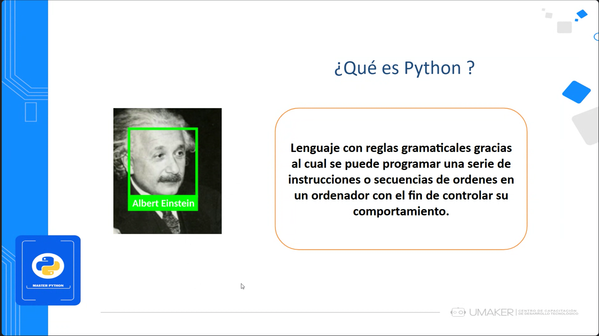

### 2️⃣ **🔄 Ejemplo de ejecución de Python**
Python es un lenguaje versátil y multiplataforma, compatible con sistemas operativos como Windows, Linux, Android y iOS. A continuación, se muestra un ejemplo básico de código en Python que imprime "Hola Mundo" en la terminal:

```python
print("Hola Mundo")
```

Este simple programa demuestra su facilidad de uso y legibilidad.

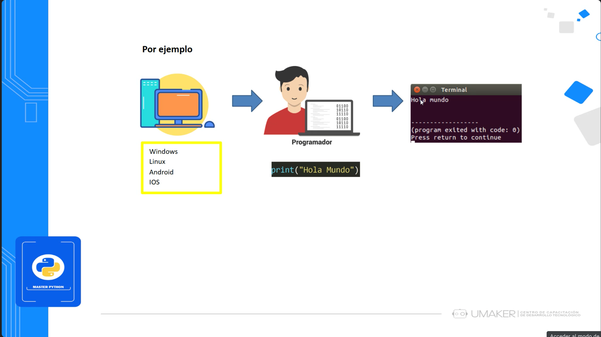

### 3️⃣ **🛠 Implementación de Python (CPython)**
El proceso de ejecución de un programa en Python involucra:

- Edición del código fuente (.py)
- Compilación a bytecode (.pyc)
- Interpretación y ejecución

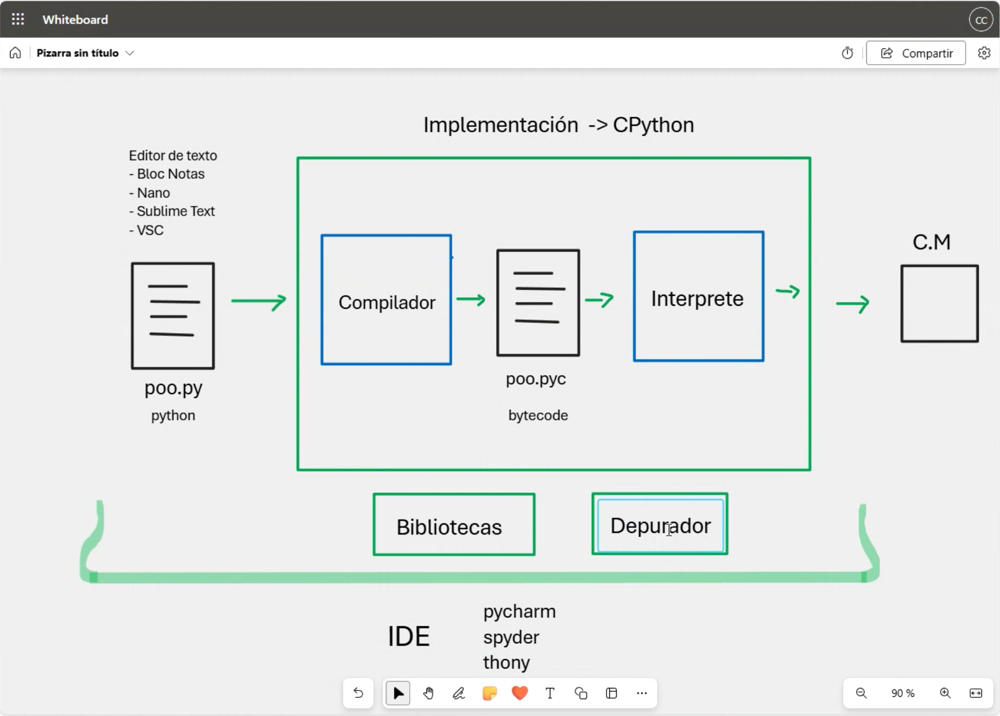

### 4️⃣ **💻 Tipos de lenguajes de programación**
Comparación entre Python y otros lenguajes como Java, C, C++, JavaScript y Assembler.

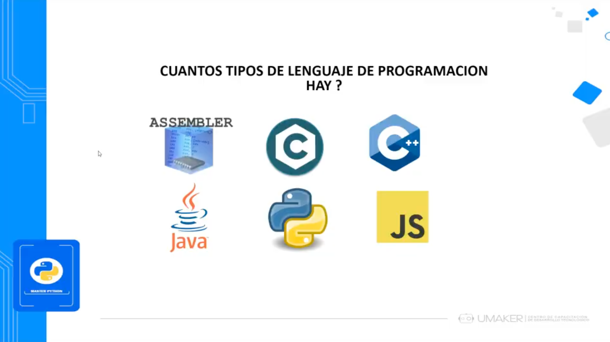

### 5️⃣ **🎉 ¿Por qué aprender Python?**
Python es ampliamente utilizado por su versatilidad y aplicación en diferentes campos de la tecnología.

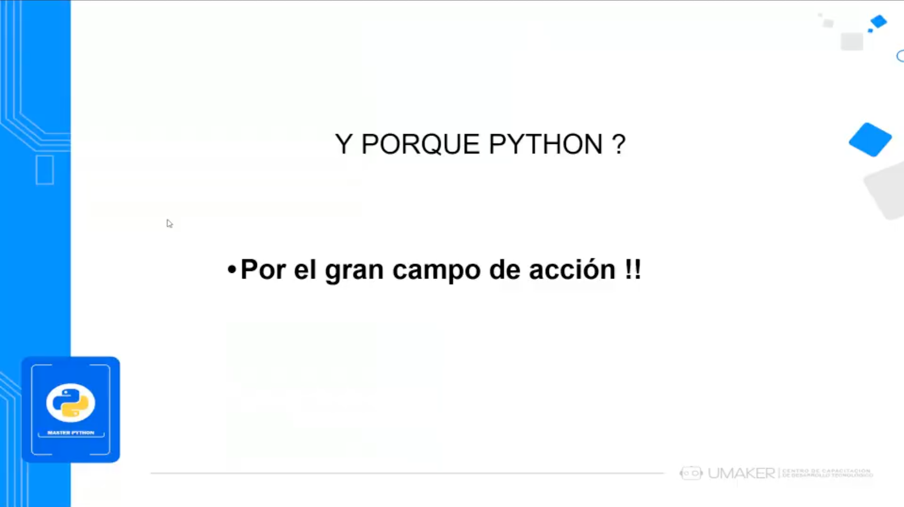

### 6️⃣ **🌿 Aplicaciones en Agricultura**
Python se emplea en el monitoreo ambiental con sensores y bases de datos.

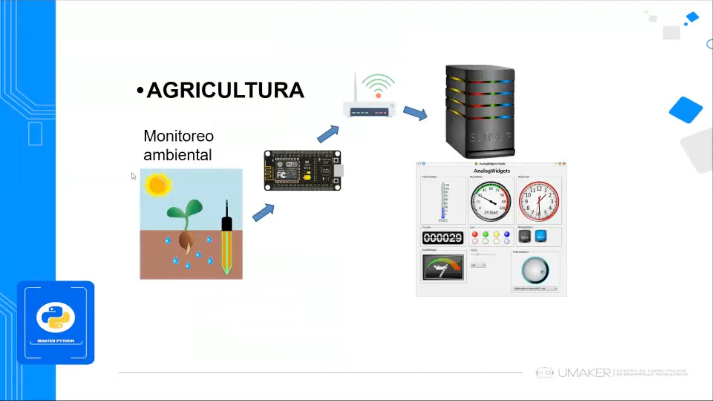

### 7️⃣ **📸 Visión Artificial con OpenCV**
Aplicaciones de reconocimiento facial y detección de objetos con Python.

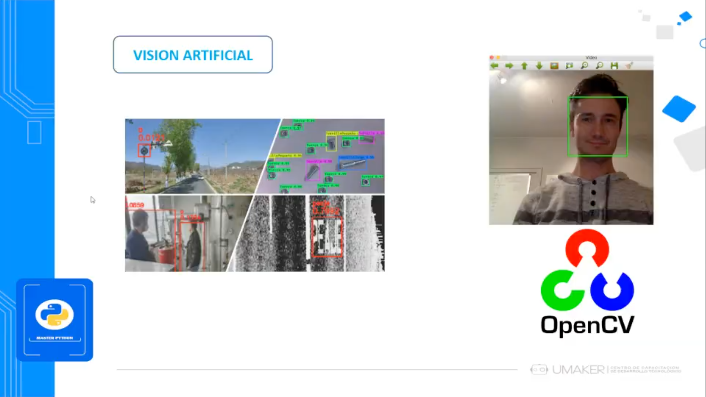

### 8️⃣ **🌍 Geoprocesos con ArcGIS**
Uso de Python en SIG (Sistemas de Información Geográfica).

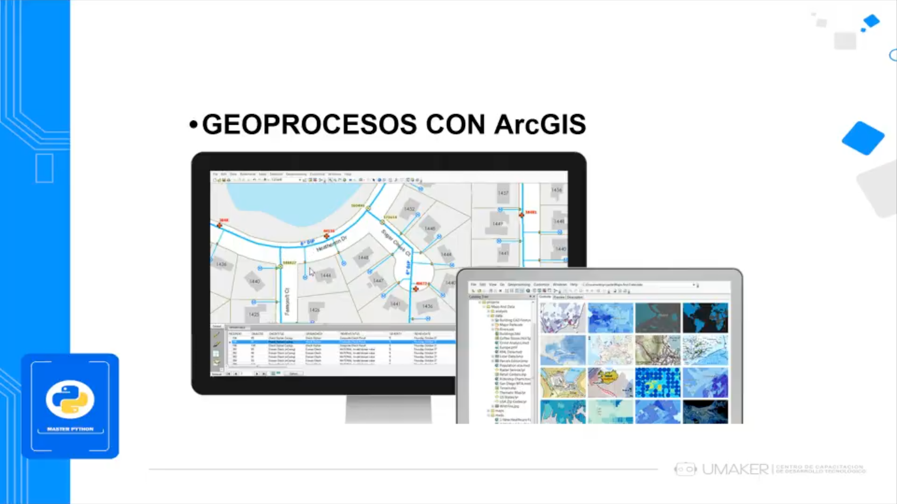

### 9️⃣ **🗃️ Web Scraping**
Automatización de extracción de datos desde la web con Python.

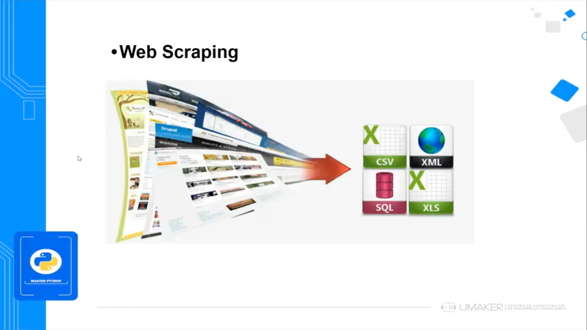

### 🔌 **Integraciones con Redes Sociales**
Python se usa para automatizar interacciones con Facebook y Twitter.

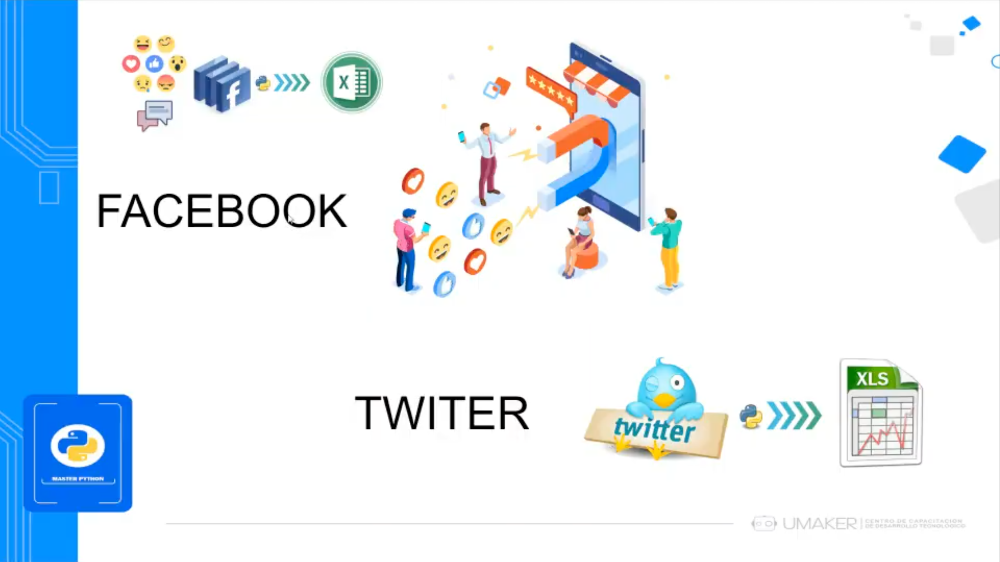

### 🎨 **Diseño de Interfaz Gráfica con PyQt5**
Desarrollo de aplicaciones con interfaces gráficas interactivas utilizando PyQt5.

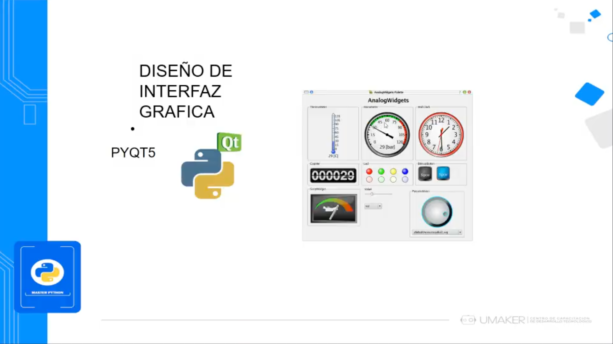

### 🌐 **Desarrollo Web con Flask**
Python permite el desarrollo de aplicaciones web a través de frameworks como Flask.

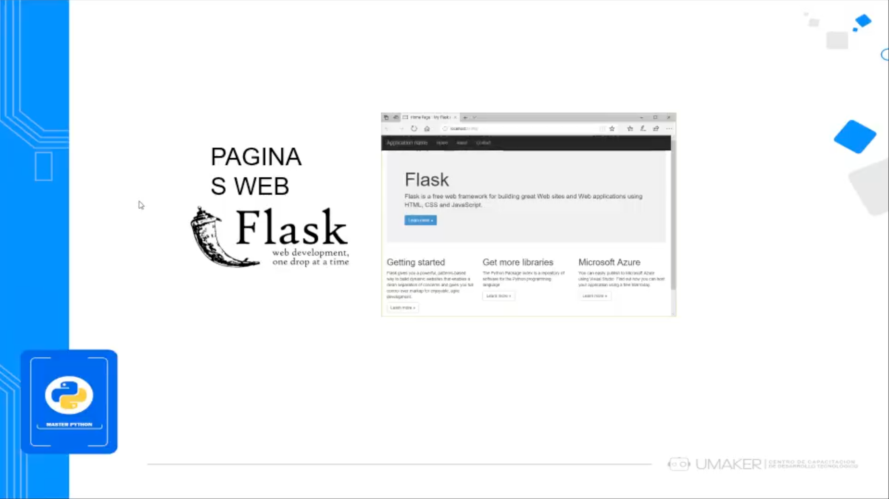

### 🤖 **Python y Robótica**
Aplicaciones de Python en sistemas robóticos y automatización.

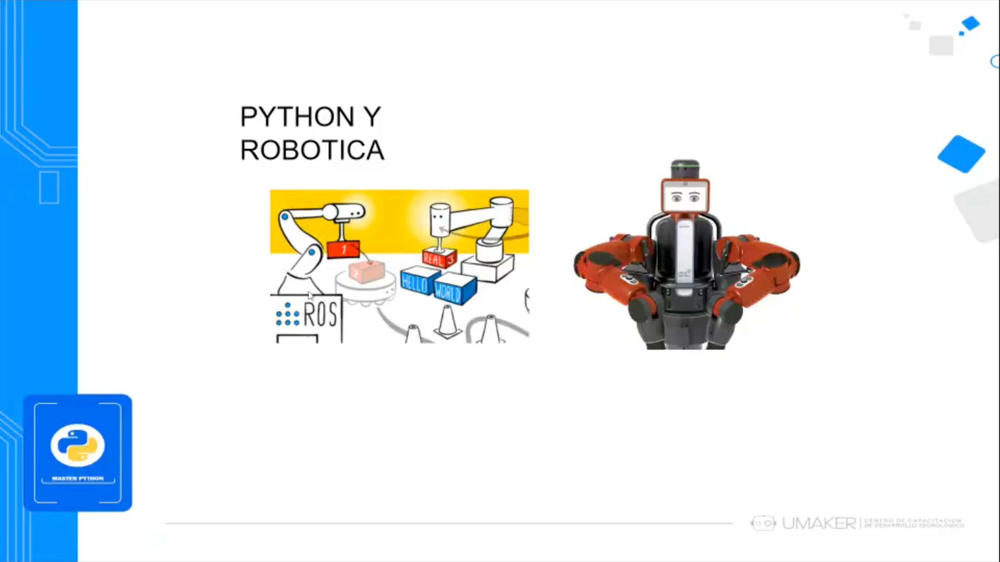

### 📊 **Matplotlib, SciPy y NumPy**
Bibliotecas de Python para visualización de datos, procesamiento de señales y álgebra lineal.

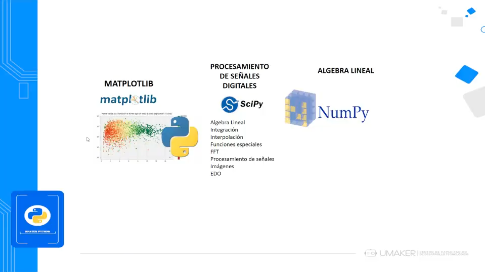

### 🖥️ **IDE para Python**
Herramientas como Sublime Text y PyCharm para la escritura y ejecución de código en Python.

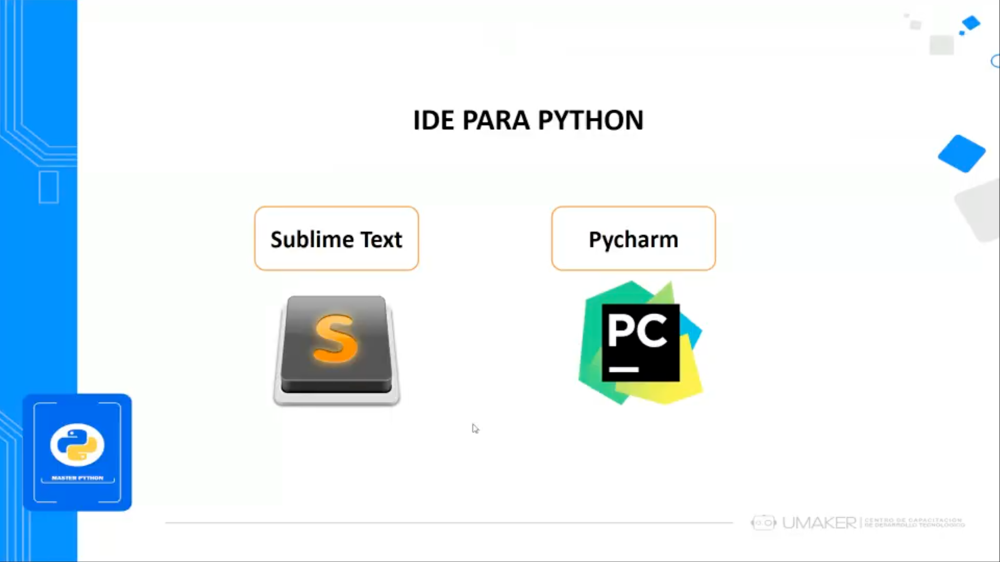

### 🖥️ **Uso de CLI en Python**
Ejecución de comandos y scripts en Python a través de la línea de comandos.

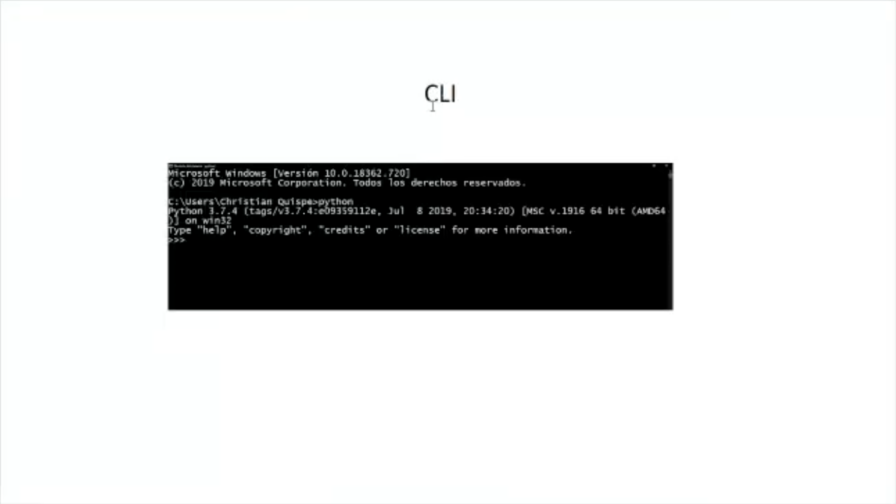

### 📝 **Entornos de Programación en Python**
Jupyter, Spyder y Anaconda como herramientas clave para la programación en Python.

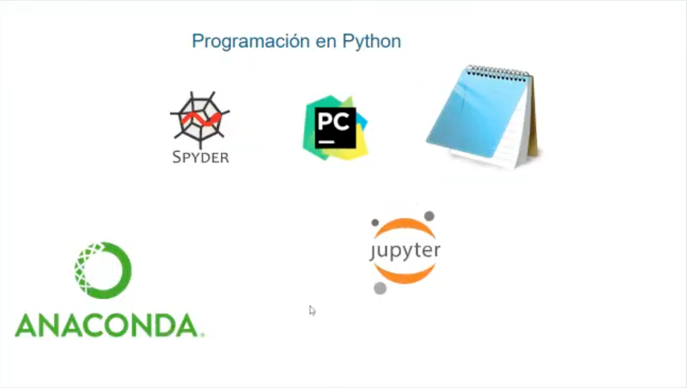

---

## 👨‍💻 Sobre el Autor

- **👤 Nombre:** Edwin Yoner
- **📧 Contacto:** [✉ edwinyoner@gmail.com](mailto:edwinyoner@gmail.com)
- **🔗 LinkedIn:** [🌐 linkedin.com/in/edwinyoner](https://www.linkedin.com/in/edwinyoner)