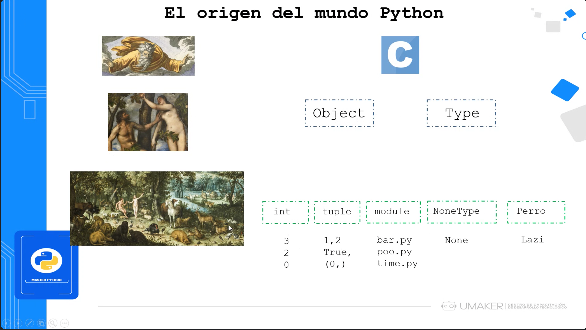
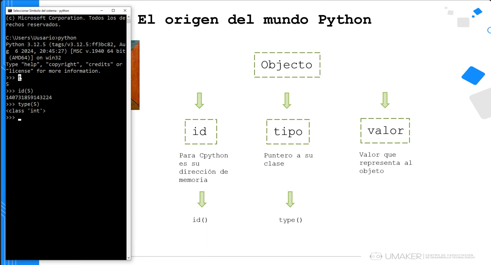
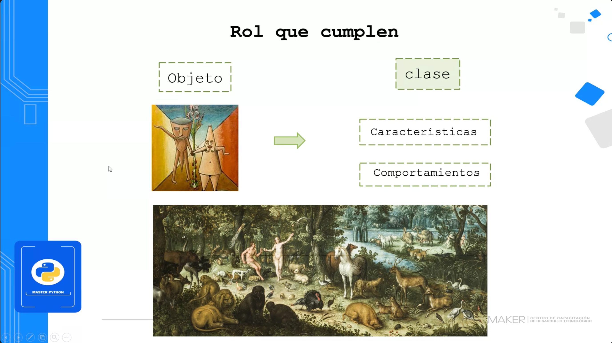
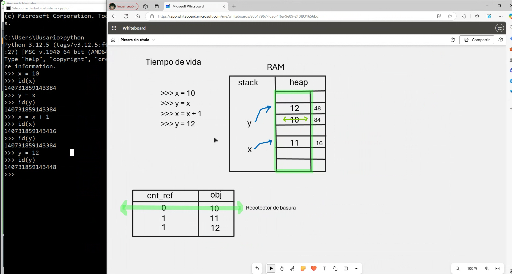
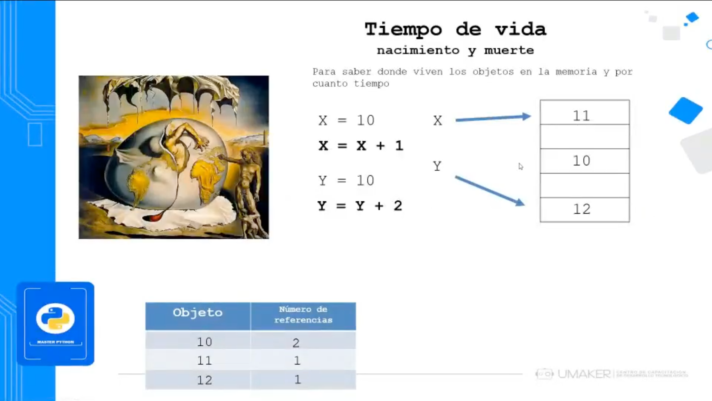
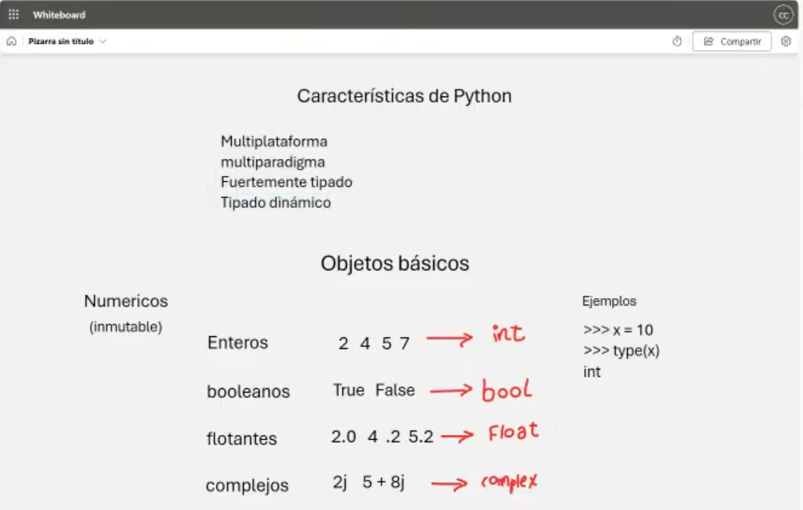
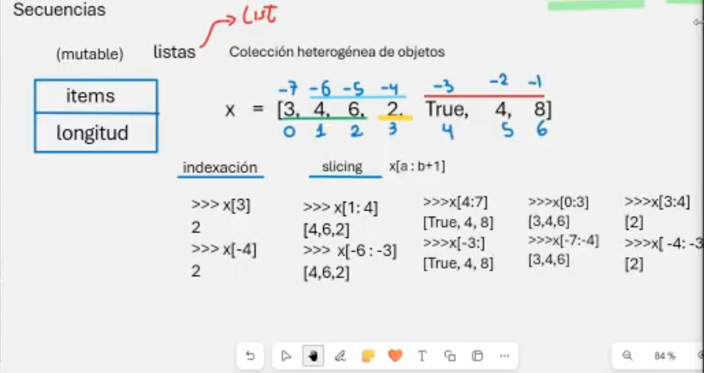

# 💻 Clase 2: Objetos

En esta clase, exploramos el concepto fundamental de **objetos**, cómo se almacenan en memoria y su relación con el sistema de gestión de memoria del lenguaje. Además, conoceremos los diferentes tipos de datos y cómo Python maneja sus estructuras de datos de manera eficiente.

---

## 📚 Contenido

### 1️⃣ **📝 El Origen del Mundo Python**

Python es un lenguaje de programación de alto nivel derivado de C, diseñado para ser más legible y fácil de usar. Su diseño prioriza la simplicidad y la eficiencia, lo que lo convierte en una opción ideal tanto para principiantes como para expertos en desarrollo de software.

### 2️⃣ **🔍 Objetos y Tipos en Python**

En Python, todo es un objeto. Cada valor en Python pertenece a una clase específica y tiene un tipo de dato que define sus propiedades y comportamientos.

### 3️⃣ **🛠 Identidad, Tipo y Valor de los Objetos**

Cada objeto en Python tiene tres características fundamentales:
- **Identidad**: Dirección de memoria única donde se almacena el objeto.
- **Tipo**: Define qué operaciones pueden realizarse sobre el objeto.
- **Valor**: Representación del contenido del objeto, que puede cambiar con el tiempo en objetos mutables.

### 4️⃣ **🏛️ Clases y Objetos en Python**

Python es un lenguaje orientado a objetos, donde los objetos son instancias de clases. Las clases actúan como plantillas que definen las propiedades (atributos) y comportamientos (métodos) de los objetos.

### 5️⃣ **⏳ Tiempo de Vida de los Objetos**

El tiempo de vida de un objeto en Python está determinado por su referencia en memoria. Cuando un objeto deja de ser referenciado, Python lo elimina automáticamente para liberar espacio.

### 6️⃣ **🧠 Gestión de Memoria en Python**

Python maneja la memoria mediante un sistema de gestión automática conocido como **recolector de basura**, el cual detecta y elimina objetos que ya no están en uso, optimizando el rendimiento del programa.

### 7️⃣ **📌 Características de Python**

Python se caracteriza por ser:
- **Multiparadigma**: Soporta programación imperativa, orientada a objetos y funcional.
- **Fuertemente tipado**: No permite conversiones implícitas entre tipos incompatibles.
- **Tipado dinámico**: No es necesario declarar el tipo de una variable antes de asignarle un valor.

### 8️⃣ **📚 Tipos de Datos en Python**

Python ofrece una gran variedad de tipos de datos integrados, entre ellos:
- **Numéricos** (int, float, complex) → Representan números enteros, decimales y complejos.
- **Booleanos** (True, False) → Se usan para representar valores de verdad en expresiones lógicas.
- **Secuencias** (str, list, tuple) → Almacenan múltiples valores en una estructura ordenada.

### 9️⃣ **📑 Listas en Python**

Las listas son una de las estructuras de datos más utilizadas en Python. Permiten almacenar colecciones de elementos heterogéneos y ofrecen una amplia variedad de métodos para manipular sus datos.

Operaciones comunes con listas:
- **Indexación**: Acceso a elementos individuales mediante índices.
- **Slicing**: Extracción de subconjuntos de la lista.
- **Mutabilidad**: Las listas pueden modificarse después de su creación.

---

## 👨‍💻 Sobre el Autor

- **👤 Nombre:** Edwin Yoner
- **📧 Contacto:** [✉ edwinyoner@gmail.com](mailto\:edwinyoner@gmail.com)
- **🔗 LinkedIn:** [🌐 linkedin.com/in/edwinyoner](https://www.linkedin.com/in/edwinyoner)
