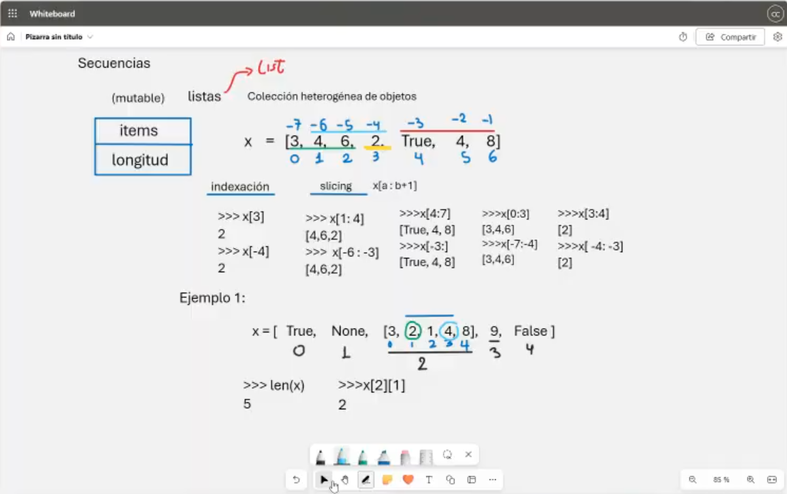
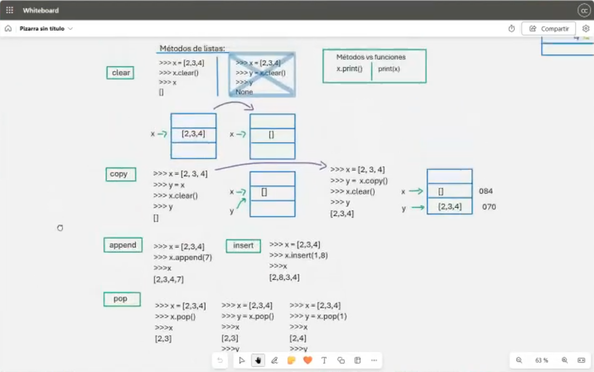

# Clase 3: Listas

## Descripción
Las listas en Python son estructuras de datos ordenadas, mutables y heterogéneas. Permiten almacenar múltiples valores en una sola variable y ofrecen métodos eficientes para manipular sus elementos. En esta clase exploraremos la indexación, slicing y los métodos más comunes para operar con listas.

## 📌 Indexación y Slicing
Podemos acceder a los elementos de una lista mediante índices positivos y negativos, así como obtener subconjuntos de elementos usando slicing.



### Ejemplo:
```python
x = [True, None, [3, 2, 1, 4, 8], 9, False]
print(x)  # [True, None, [3, 2, 1, 4, 8], 9, False]
print(len(x))  # 5 (cantidad de elementos en la lista)
```

Acceder a elementos específicos:
```python
print(x[2][1])  # 2 (segundo elemento de la sublista x[2])
print(x[1])  # None
print(x[2][1:4])  # [2, 1, 4] (sublista desde el índice 1 hasta 3)
print(x[2][3:4])  # [4] (sublista desde el índice 3 hasta 3)
print(x[2][:])  # [3, 2, 1, 4, 8] (copia completa de la sublista)
```

## 📌 Métodos de Listas
Python proporciona múltiples métodos para modificar listas de manera eficiente.



### 1. `clear()`
Elimina todos los elementos de la lista.
```python
x = [2, 3, 4]
x.clear()
print(x)  # []
```

### 2. `copy()`
Crea una copia independiente de la lista.
```python
x = [2, 3, 4]
y = x.copy()
print(y)  # [2, 3, 4]
print(id(x) != id(y))  # True (diferentes referencias en memoria)
```

### 3. `append()`
Agrega un elemento al final de la lista.
```python
x = [2, 3, 4]
x.append(7)
print(x)  # [2, 3, 4, 7]
```

### 4. `insert()`
Inserta un elemento en una posición específica.
```python
x = [2, 3, 4]
x.insert(1, 8)
print(x)  # [2, 8, 3, 4]
```

### 5. `pop()`
Elimina y devuelve un elemento de la lista (por defecto, el último).
```python
x = [2, 3, 4]
y = x.pop()
print(x)  # [2, 3]
print(y)  # 4
```

Eliminar un elemento en una posición específica:
```python
x = [2, 3, 4]
y = x.pop(1)
print(x)  # [2, 4]
print(y)  # 3
```

---

## 👨‍💻 Sobre el Autor

- **👤 Nombre:** Edwin Yoner
- **📧 Contacto:** [✉ edwinyoner@gmail.com](mailto:edwinyoner@gmail.com)
- **🔗 LinkedIn:** [🌐 linkedin.com/in/edwinyoner](https://www.linkedin.com/in/edwinyoner)