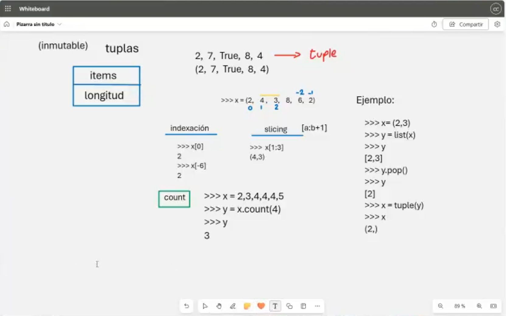
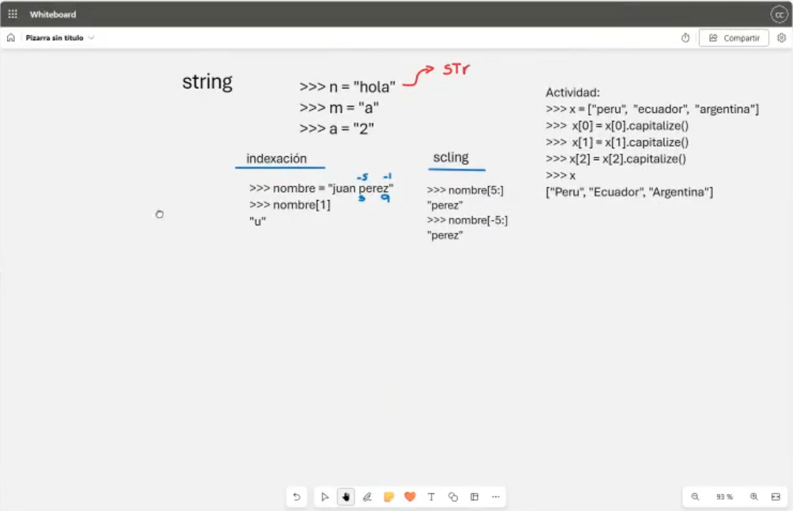
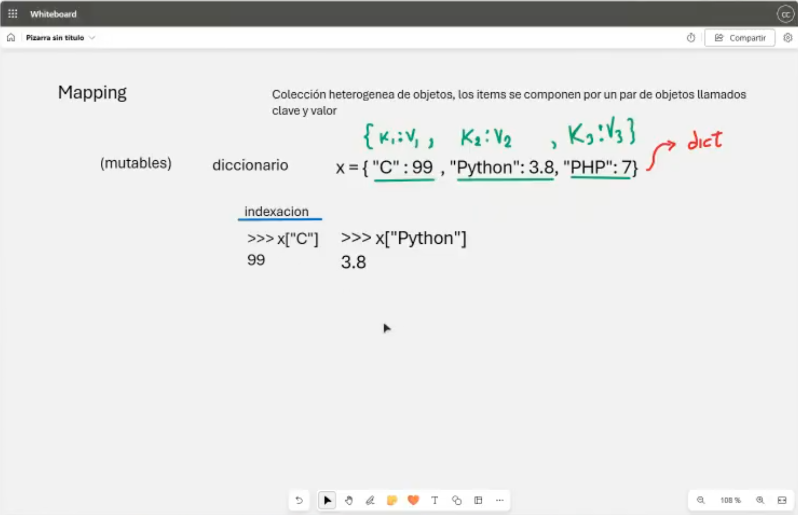

# Clase 4: Tuplas, Strings y Mappings

## Descripción

En esta clase exploramos tres estructuras de datos fundamentales en Python: **tuplas**, **strings** y **mappings (diccionarios)**. Aprenderemos sus diferencias con las listas, su uso en el almacenamiento de datos y las operaciones principales que podemos realizar sobre ellas.

---

## 📌 Tuplas

Las **tuplas** son estructuras de datos **inmutables**, lo que significa que sus elementos no pueden ser modificados después de su creación. Son similares a las listas pero con la ventaja de que ocupan menos memoria y proporcionan mayor seguridad en los datos almacenados.

### Características de las Tuplas:

- Se definen con paréntesis `()`.
- Permiten almacenar cualquier tipo de dato.
- Soportan indexación y slicing, al igual que las listas.
- No pueden ser modificadas tras su creación.



### Ejemplo:

```python
x = (2, 7, True, 8, 4)
print(x[0])  # 2
print(x[-1])  # 4
```

#### Conteo de elementos en una tupla:

```python
x = (2, 3, 4, 4, 4, 5)
y = x.count(4)
print(y)  # 3 (cantidad de veces que aparece el número 4 en la tupla)
```

---

## 📌 Strings

Los **strings** son cadenas de caracteres inmutables. Python los trata como secuencias de caracteres, lo que permite acceder a ellos con indexación y slicing.

### Características de los Strings:

- Se definen entre comillas simples `'` o dobles `"`.
- Soportan indexación y slicing.
- Son inmutables, lo que significa que no se pueden modificar directamente.
- Poseen múltiples métodos incorporados para manipular texto.



### Ejemplo:

```python
nombre = "Juan Perez"
print(nombre[1])  # u (segundo caracter de la cadena)
print(nombre[5:])  # "Perez" (subcadena desde el índice 5 hasta el final)
```

#### Ejemplo de capitalización de una lista de strings:

```python
x = ["peru", "ecuador", "argentina"]
x[0] = x[0].capitalize()
x[1] = x[1].capitalize()
x[2] = x[2].capitalize()
print(x)  # ['Peru', 'Ecuador', 'Argentina']
```

---

## 📌 Mapping (Diccionarios)

Los **diccionarios** en Python son estructuras de datos que almacenan valores en pares **clave:valor**. Son mutables y permiten una búsqueda rápida de valores mediante sus claves.

### Características de los Diccionarios:

- Se definen con llaves `{}`.
- Permiten almacenar datos heterogéneos.
- Son mutables, es decir, sus valores pueden modificarse.
- No permiten claves duplicadas.



### Ejemplo:

```python
x = {"C": 99, "Python": 3.8, "PHP": 7}
print(x["C"])  # 99
print(x["Python"])  # 3.8
```

---

## 👨‍💻 Sobre el Autor

- **👤 Nombre:** Edwin Yoner
- **📧 Contacto:** [✉ edwinyoner@gmail.com](mailto:edwinyoner@gmail.com)
- **🔗 LinkedIn:** [🌐 linkedin.com/in/edwinyoner](https://www.linkedin.com/in/edwinyoner)