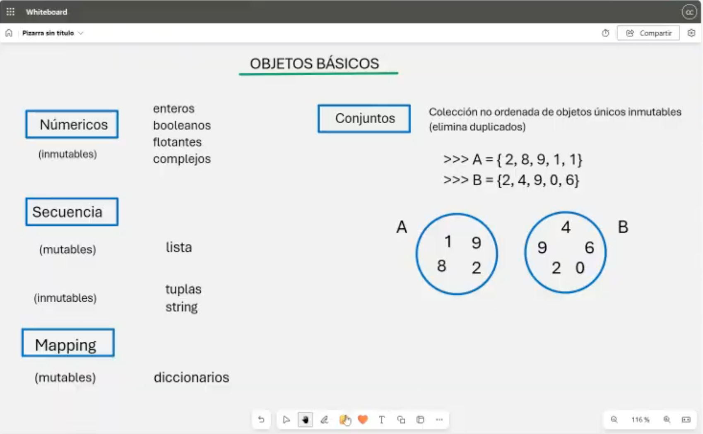
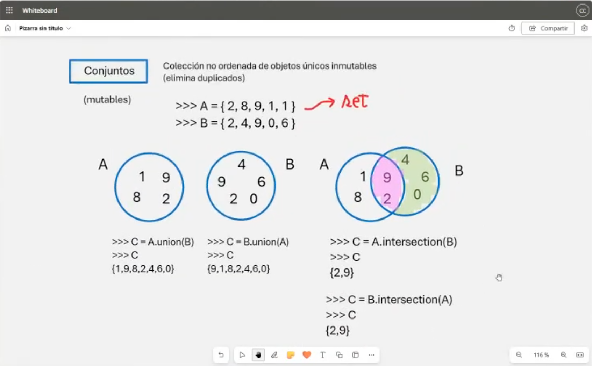
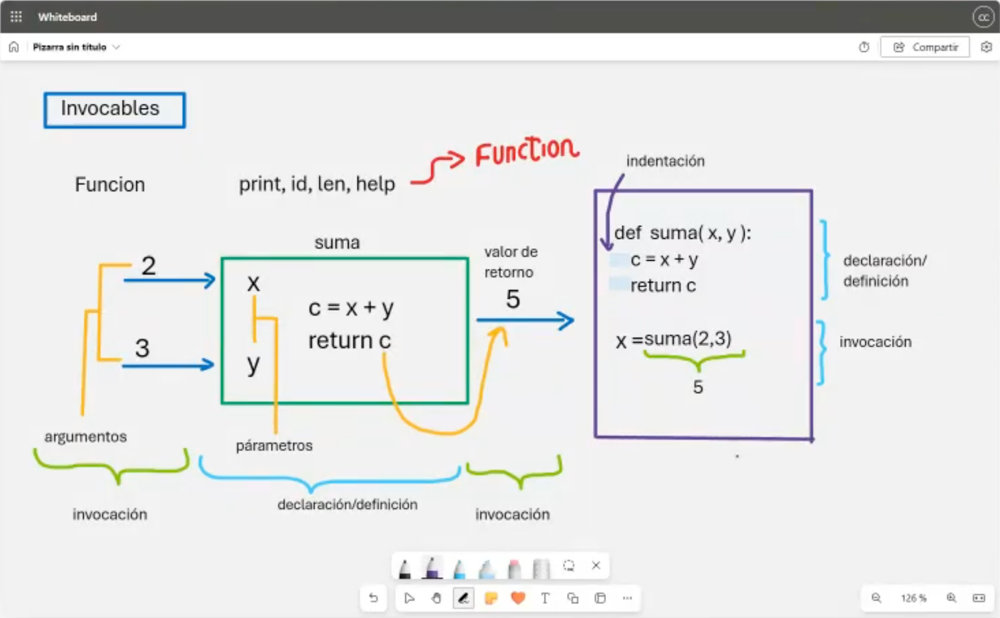
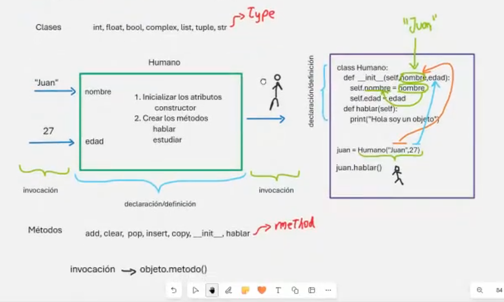
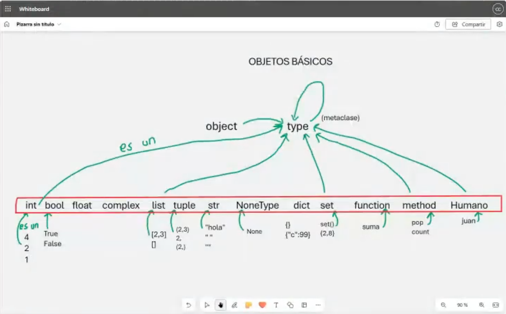

# Clase 5: Conjuntos, Funciones, Clases y Métodos

## Descripción

En esta clase exploramos cuatro conceptos fundamentales en Python: **Conjuntos (sets)**, **Funciones**, **Clases** y **Métodos**. Aprenderemos cómo utilizarlos para estructurar y optimizar nuestro código de manera eficiente.

---

## 📌 Conjuntos en Python

Los **conjuntos (sets)** en Python son colecciones no ordenadas de elementos únicos. Esto significa que no permiten duplicados y pueden ser utilizados para realizar operaciones matemáticas como **unión**, **intersección** y **diferencia**.



### Ejemplo:
```python
A = {2, 8, 9, 1, 1}  # Se eliminan los duplicados automáticamente
B = {2, 4, 9, 0, 6}

print(A | B)  # Unión de conjuntos
print(A & B)  # Intersección de conjuntos
print(A - B)  # Diferencia de conjuntos
```

---

## 📌 Operaciones con Conjuntos

Las principales operaciones con conjuntos incluyen:
- **Unión**: Combina los elementos de ambos conjuntos.
- **Intersección**: Obtiene los elementos comunes entre dos conjuntos.
- **Diferencia**: Obtiene los elementos que están en un conjunto pero no en el otro.



### Ejemplo:
```python
C = A.union(B)  # Unión
D = A.intersection(B)  # Intersección
E = A.difference(B)  # Diferencia
```

---

## 📌 Funciones en Python

Las **funciones** permiten agrupar código reutilizable en bloques organizados. Se pueden definir con `def` y pueden aceptar argumentos y devolver valores.



### Ejemplo:
```python
def suma(x, y):
    return x + y

resultado = suma(2, 3)
print(resultado)  # 5
```

---

## 📌 Clases y Métodos en Python

Python es un lenguaje orientado a objetos. Las **clases** nos permiten definir estructuras personalizadas con atributos y métodos. Los **métodos** son funciones definidas dentro de una clase que operan sobre los objetos de esa clase.



### Ejemplo:
```python
class Humano:
    def __init__(self, nombre, edad):
        self.nombre = nombre
        self.edad = edad
    
    def hablar(self):
        print(f"Hola, soy {self.nombre}")

juan = Humano("Juan", 27)
juan.hablar()  # Salida: Hola, soy Juan
```

---

## 📌 Resumen de Objetos en Python

Todos los elementos en Python son objetos que pertenecen a una clase específica. La metaclase `type` es la base de todas las clases y proporciona información sobre el tipo de los objetos.



---

## 👨‍💻 Sobre el Autor

- **👤 Nombre:** Edwin Yoner
- **📧 Contacto:** [✉ edwinyoner@gmail.com](mailto:edwinyoner@gmail.com)
- **🔗 LinkedIn:** [🌐 linkedin.com/in/edwinyoner](https://www.linkedin.com/in/edwinyoner)