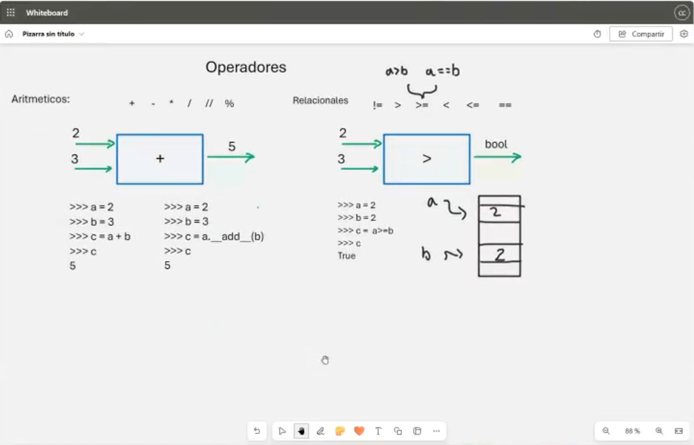

# Clase 6: Operadores

## Descripción

Los **operadores** en Python nos permiten realizar operaciones matemáticas, comparaciones lógicas y manipulaciones con variables y objetos. Existen diferentes tipos de operadores en Python que exploraremos en esta clase.

---

## 📈 Operadores Aritméticos

Los operadores aritméticos nos permiten realizar operaciones matemáticas básicas.



### Ejemplo:

```python
# Operaciones básicas
x = 10
y = 3

suma = x + y      # 13
resta = x - y     # 7
multiplicacion = x * y  # 30
division = x / y   # 3.333...
division_entera = x // y  # 3 (redondeo hacia abajo)
modulo = x % y     # 1 (residuo de la división)
potencia = x ** y  # 1000 (10^3)

print(suma, resta, multiplicacion, division, division_entera, modulo, potencia)
```

---

## 📊 Operadores Relacionales o de Comparación

Los operadores relacionales nos permiten comparar valores y devuelven un valor booleano (`True` o `False`).

### Lista de Operadores:
- `==` (igual a)
- `!=` (diferente de)
- `>` (mayor que)
- `<` (menor que)
- `>=` (mayor o igual que)
- `<=` (menor o igual que)

### Ejemplo:
```python
a = 5
b = 10

print(a == b)  # False
print(a != b)  # True
print(a > b)   # False
print(a < b)   # True
print(a >= b)  # False
print(a <= b)  # True
```

---

## 🔀 Operadores Lógicos

Los operadores lógicos nos permiten combinar expresiones booleanas.

### Lista de Operadores:
- `and` (devuelve `True` si ambas condiciones son verdaderas)
- `or` (devuelve `True` si al menos una condición es verdadera)
- `not` (invierte el resultado, `True` se vuelve `False` y viceversa)

### Ejemplo:
```python
x = True
y = False

print(x and y)  # False
print(x or y)   # True
print(not x)    # False
```

---

## 🌐 Operadores de Asignación

Los operadores de asignación se utilizan para asignar valores a variables de manera eficiente.

### Lista de Operadores:
- `=`  Asigna un valor a la variable
- `+=` Suma y asigna
- `-=` Resta y asigna
- `*=` Multiplica y asigna
- `/=` Divide y asigna
- `//=` División entera y asigna
- `%=` Módulo y asigna
- `**=` Potencia y asigna

### Ejemplo:
```python
x = 5
x += 3  # Equivalente a x = x + 3
print(x)  # 8

x *= 2  # Equivalente a x = x * 2
print(x)  # 16
```

---

## 🛠️ Operadores Especiales

### Operadores de Identidad (`is`, `is not`)
Se utilizan para comprobar si dos variables apuntan al mismo objeto en memoria.

```python
a = [1, 2, 3]
b = a
c = [1, 2, 3]

print(a is b)   # True (mismo objeto en memoria)
print(a is c)   # False (distintos objetos con el mismo contenido)
print(a is not c)  # True
```

### Operadores de Pertenencia (`in`, `not in`)
Se utilizan para verificar si un valor está presente en una secuencia (lista, tupla, conjunto o diccionario).

```python
frutas = ["manzana", "banana", "naranja"]
print("banana" in frutas)  # True
print("pera" not in frutas)  # True
```

---

## 👨‍💻 Sobre el Autor

- **👤 Nombre:** Edwin Yoner
- **📧 Contacto:** [✉ edwinyoner@gmail.com](mailto:edwinyoner@gmail.com)
- **🔗 LinkedIn:** [🌐 linkedin.com/in/edwinyoner](https://www.linkedin.com/in/edwinyoner)