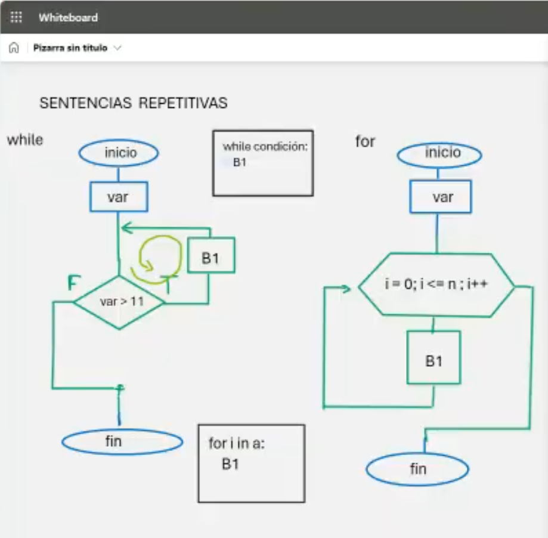
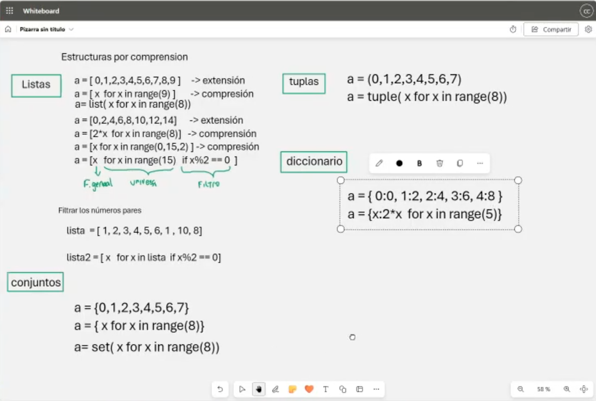

# Clase 8: Sentencias Repetitivas y Estructuras por Comprensión

## Descripción

En esta clase abordamos las **sentencias repetitivas** en Python, que permiten ejecutar un bloque de código varias veces, y las **estructuras por comprensión**, que facilitan la generación de listas, conjuntos y diccionarios de manera concisa y eficiente.

---

## ♲ Sentencias Repetitivas: `while` y `for`

Las **sentencias repetitivas** permiten ejecutar un bloque de código mientras una condición sea verdadera o recorrer estructuras iterables como listas y tuplas.



### 1. Bucle `while`

Ejecuta un bloque de código mientras una condición sea `True`.

```python
contador = 0
while contador < 5:
    print(f"Iteración {contador}")
    contador += 1
```

### 2. Bucle `for`

Se usa para recorrer secuencias como listas, tuplas y rangos.

```python
for i in range(5):
    print(f"Iteración {i}")
```

---

## 🛠️ Estructuras por Comprensión

Las **estructuras por comprensión** permiten generar listas, conjuntos y diccionarios de manera concisa y legible.



### 1. Comprensión de Listas

Permite crear listas de manera eficiente sin necesidad de bucles `for` tradicionales.

```python
numeros = [x for x in range(10)]
print(numeros)  # [0, 1, 2, 3, 4, 5, 6, 7, 8, 9]
```

Filtrar números pares:

```python
pares = [x for x in range(10) if x % 2 == 0]
print(pares)  # [0, 2, 4, 6, 8]
```

### 2. Comprensión de Conjuntos

Similar a las listas, pero devuelve un `set`.

```python
conjunto_pares = {x for x in range(10) if x % 2 == 0}
print(conjunto_pares)  # {0, 2, 4, 6, 8}
```

### 3. Comprensión de Tuplas

Podemos generar tuplas utilizando la función `tuple()` junto con comprensión.

```python
tupla_numeros = tuple(x for x in range(8))
print(tupla_numeros)  # (0, 1, 2, 3, 4, 5, 6, 7)
```

### 4. Comprensión de Diccionarios

Genera un diccionario con claves y valores de manera eficiente.

```python
dobles = {x: x * 2 for x in range(5)}
print(dobles)  # {0: 0, 1: 2, 2: 4, 3: 6, 4: 8}
```

---

## 👨‍💻 Sobre el Autor

- **👤 Nombre:** Edwin Yoner
- **📧 Contacto:** [✉ edwinyoner@gmail.com](mailto:edwinyoner@gmail.com)
- **🔗 LinkedIn:** [🌐 linkedin.com/in/edwinyoner](https://www.linkedin.com/in/edwinyoner)