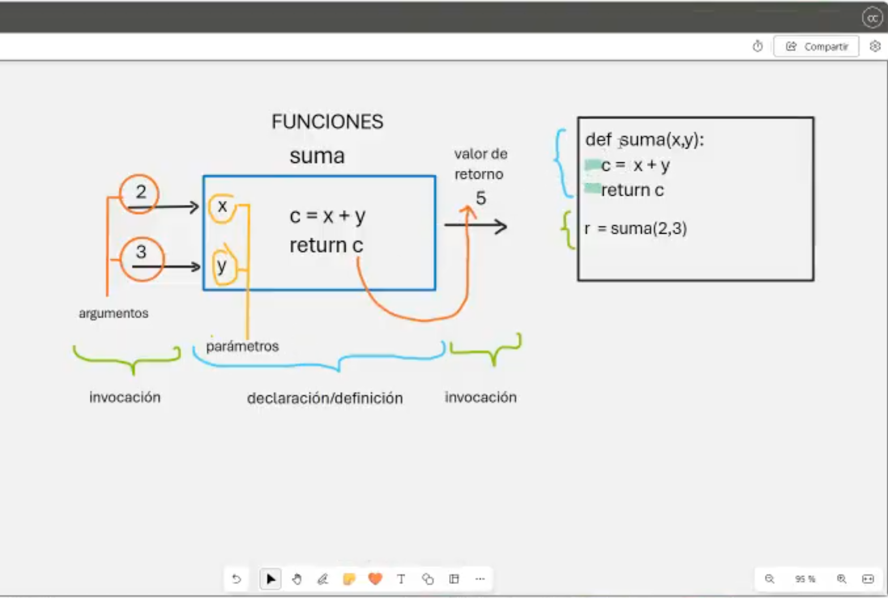
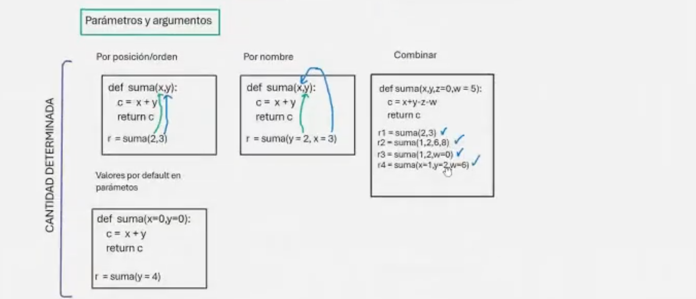
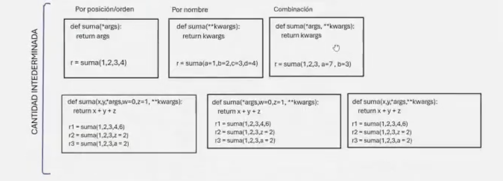
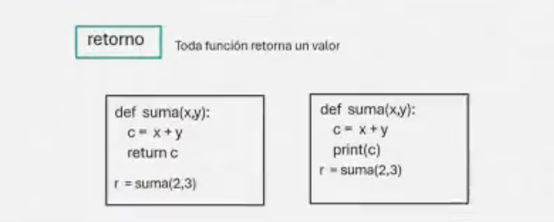

# Clase 10: Funciones

## Descripción

Las **funciones** en Python son bloques de código reutilizables que permiten estructurar el código de manera modular y organizada. Facilitan la reutilización de código y mejoran la legibilidad.



---

## ✨ Definición de Funciones

Para definir una función en Python, se usa la palabra clave `def`.

```python
# Definiendo una función

def suma(x, y):
    c = x + y
    return c

# Llamando a la función
resultado = suma(2, 3)
print(resultado)  # Salida: 5
```


## 🔄 Parámetros y Argumentos

Las funciones pueden recibir valores llamados **parámetros** y usarlos dentro de su bloque de código. Los valores que se pasan a una función se llaman **argumentos**.

### Cantidad Determinada



#### Parámetros por Posición

```python
def suma(x, y):
    return x + y

r = suma(2, 3)  # Argumentos pasados en orden
print(r)  # Salida: 5
```

#### Parámetros por Nombre

```python
def suma(x, y):
    return x + y

r = suma(y=2, x=3)  # Argumentos pasados por nombre
print(r)  # Salida: 5
```

#### Parámetros con Valores por Defecto

```python
def suma(x=0, y=0):
    return x + y

r = suma(y=4)  # Se usa el valor por defecto de x
print(r)  # Salida: 4
```

#### Parámetros Combinados

```python
def suma(x, y, z=0, w=5):
    return x + y - z - w

r1 = suma(2, 3)
r2 = suma(1, 2, 6, 8)
r3 = suma(1, 2, w=0)
r4 = suma(x=1, y=2, w=6)
```

### Cantidad Indeterminada



#### Parámetros por Posición (`*args`)

```python
def suma(*args):
    return sum(args)

print(suma(1, 2, 3, 4))  # Salida: 10
```

#### Parámetros por Nombre (`**kwargs`)

```python
def imprimir_datos(**kwargs):
    for clave, valor in kwargs.items():
        print(f"{clave}: {valor}")

imprimir_datos(nombre="Edwin", edad=25, ciudad="Lima")
```

#### Parámetros Combinados

```python
def suma(x, y, *args, w=0, z=1, **kwargs):
    return x + y + z

r1 = suma(1, 2, 3, 4, 6)
r2 = suma(1, 2, 3, z=2)
r3 = suma(1, 2, 3, a=2)
```

---

## 💰 Retorno de Valores

Las funciones pueden devolver valores con la palabra clave `return`.



```python
def cuadrado(n):
    return n ** 2

resultado = cuadrado(5)
print(resultado)  # Salida: 25
```

Si no se especifica un `return`, la función devuelve `None` por defecto.

---

## 👨‍💻 Sobre el Autor

- **👤 Nombre:** Edwin Yoner
- **📧 Contacto:** [✉ edwinyoner@gmail.com](mailto:edwinyoner@gmail.com)
- **🔗 LinkedIn:** [🌐 linkedin.com/in/edwinyoner](https://www.linkedin.com/in/edwinyoner)