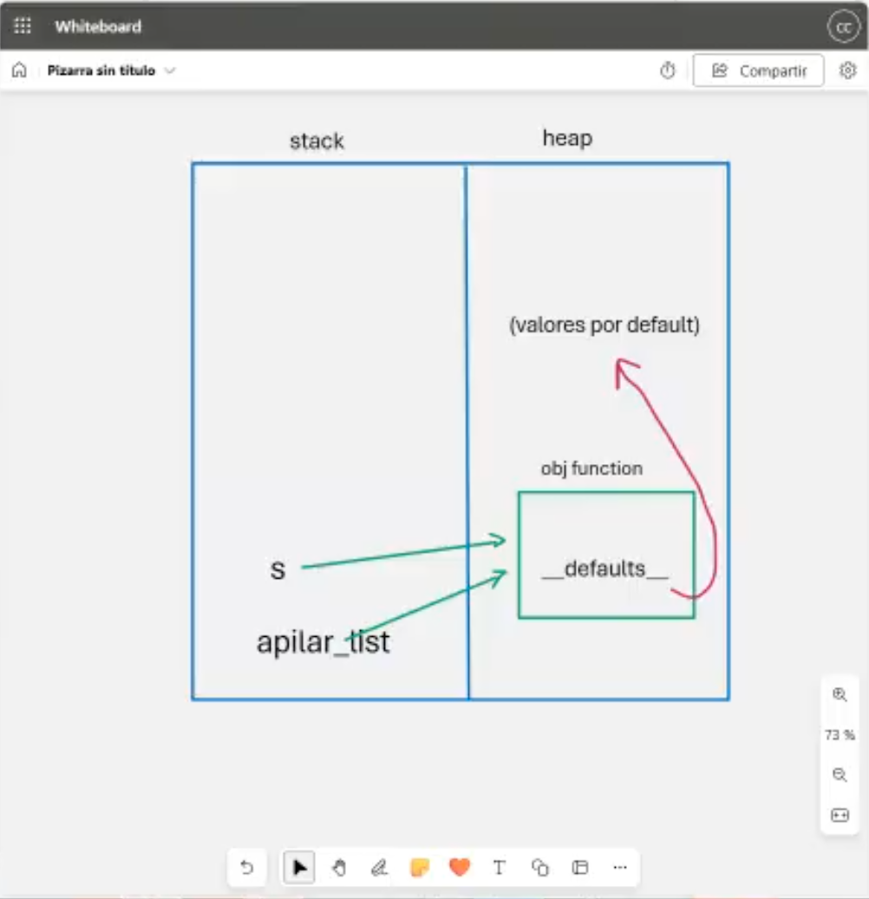
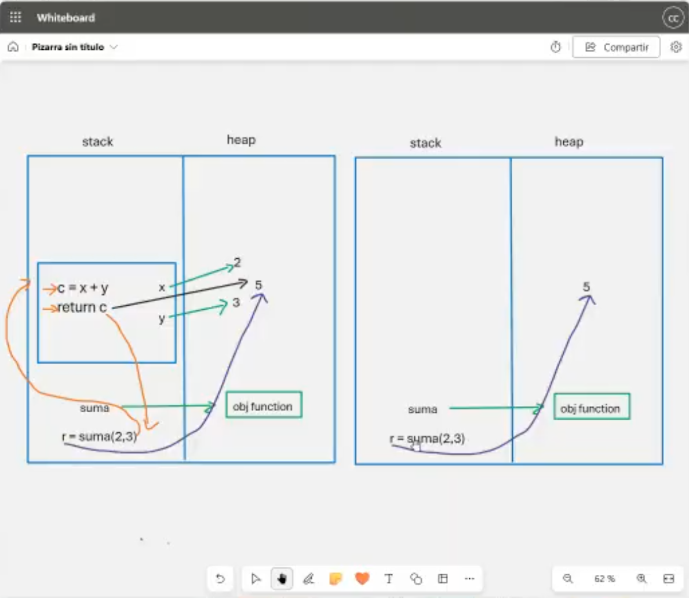
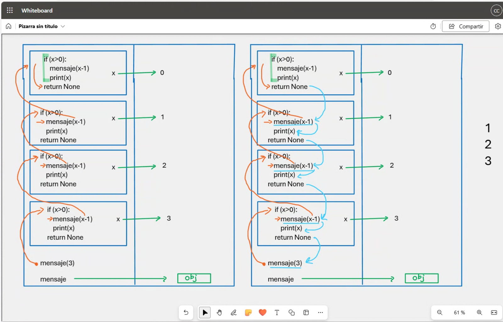

# Clase 11: Anotaciones en Funciones y Recursividad

## Introducción

Las **funciones** son bloques de código reutilizables que permiten la modularización del programa. En Python, se pueden utilizar **anotaciones en funciones** para indicar los tipos de datos esperados en los parámetros y el tipo de retorno.

Por otro lado, la **recursividad** es una técnica en la que una función se llama a sí misma para resolver un problema dividiéndolo en subproblemas más pequeños.

---

## 1️⃣ Anotaciones en Funciones

Las **anotaciones de funciones** en Python permiten documentar los tipos de los parámetros y el tipo de retorno de una función. No afectan el comportamiento del código, pero ayudan a mejorar la legibilidad y el mantenimiento.

```python
# Definición de una función con anotaciones
def suma(x: int, y: int) -> int:
    return x + y

# Llamada a la función
resultado = suma(3, 5)
print(resultado)  # Salida: 8
```

📌 **Importante**: Las anotaciones no son verificadas en tiempo de ejecución, pero pueden ser útiles para herramientas de análisis estático de código.

### Valores por Defecto con Anotaciones

```python
def suma(x: int = 0, y: int = 6) -> int:
    return x + y

print(suma(2))  # Salida: 8
```


---

## 2️⃣ Stack y Heap en Funciones

Cuando se ejecuta una función en Python:
- Las **variables locales** se almacenan en el **Stack**.
- Los **objetos mutables** (como listas o diccionarios) se almacenan en el **Heap**.

```python
# Ejemplo de Stack y Heap
def funcion():
    x = 10  # Se almacena en el Stack
    y = [1, 2, 3]  # Se almacena en el Heap
    return x, y

resultado = funcion()
print(resultado)
```



---

## 3️⃣ Recursividad

La **recursividad** es una técnica en la que una función se llama a sí misma para resolver un problema. Es útil para problemas que pueden dividirse en subproblemas más pequeños.



---

### Caso Base y Llamada Recursiva

Para evitar una recursión infinita, cada función recursiva debe tener un **caso base** que detenga la ejecución.

```python
def cuenta_regresiva(n: int):
    if n == 0:  # Caso base
        print("Fin de la recursión")
        return
    else:
        print(n)
        cuenta_regresiva(n - 1)  # Llamada recursiva

cuenta_regresiva(5)
```

### Factorial con Recursividad

```python
def factorial(n: int) -> int:
    if n == 0:  # Caso base
        return 1
    else:
        return n * factorial(n - 1)  # Llamada recursiva

print(factorial(5))  # Salida: 120
```

### Fibonacci con Recursividad

```python
def fibonacci(n: int) -> int:
    if n <= 1:
        return n
    else:
        return fibonacci(n - 1) + fibonacci(n - 2)

print(fibonacci(6))  # Salida: 8
```

## 4️⃣ Consideraciones sobre Recursividad

📌 **Ventajas**:
- Código más simple y elegante para ciertos problemas (árboles, grafos, backtracking).
- Divide el problema en subproblemas más pequeños.

⚠️ **Desventajas**:
- Puede consumir mucha memoria si no se maneja bien.
- Puede generar un **desbordamiento de pila (Stack Overflow)** si la recursión es demasiado profunda.
- En algunos casos, es menos eficiente que una solución iterativa.

---

## Conclusión

- Las **anotaciones en funciones** ayudan a mejorar la claridad del código y su mantenimiento.
- **Stack y Heap** juegan un papel fundamental en la gestión de la memoria en Python.
- La **recursividad** es una herramienta poderosa, pero debe usarse con precaución para evitar errores de memoria y rendimiento.

---

## 👨‍💻 Sobre el Autor

- **👤 Nombre:** Edwin Yoner
- **📧 Contacto:** [✉ edwinyoner@gmail.com](mailto:edwinyoner@gmail.com)
- **🔗 LinkedIn:** [🌐 linkedin.com/in/edwinyoner](https://www.linkedin.com/in/edwinyoner)