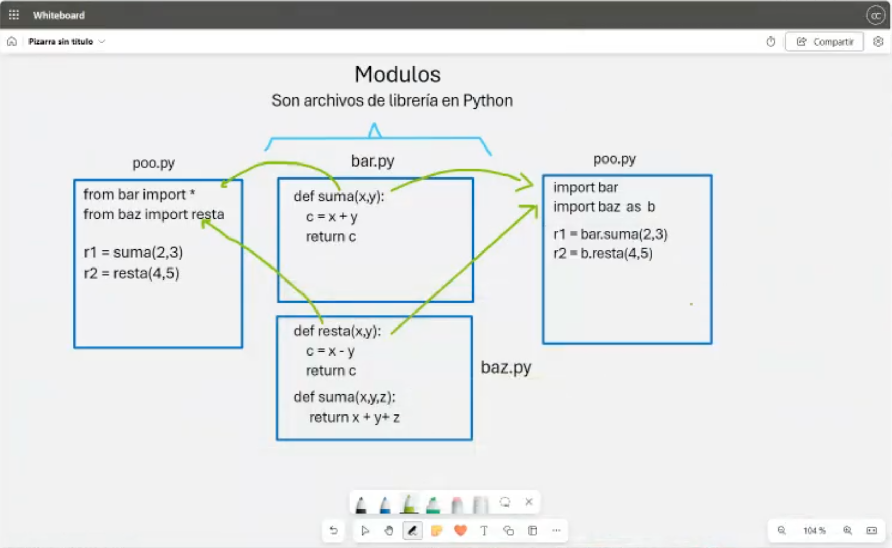

# Clase 12: Módulos en Python

## Introducción

Los **módulos** en Python son archivos que contienen definiciones de funciones, variables y clases que pueden ser reutilizados en otros programas. Permiten organizar el código en archivos separados para mejorar la modularidad y el mantenimiento del software.



---

## Creación de Módulos

Un módulo es simplemente un archivo `.py` que contiene funciones y variables que pueden ser importadas en otros scripts.

### Ejemplo de un módulo (`bar.py`)

```python
# bar.py

def suma(x, y):
    return x + y

def resta(x, y):
    return x - y
```

Para usar las funciones de este módulo en otro archivo, lo importamos con `import`.

### Uso de un módulo en otro archivo (`poo.py`)

```python
import bar

r1 = bar.suma(2, 3)
r2 = bar.resta(4, 5)

print(r1)  # Salida: 5
print(r2)  # Salida: -1
```

---

## Diferentes Formas de Importar Módulos

### 1. Importar un módulo completo
```python
import bar
print(bar.suma(2, 3))
```

### 2. Importar funciones específicas de un módulo
```python
from bar import suma
print(suma(2, 3))
```

### 3. Importar un módulo con un alias
```python
import bar as b
print(b.suma(2, 3))
```

### 4. Importar todas las funciones de un módulo (no recomendado)
```python
from bar import *
print(suma(2, 3))
```

---

## Módulos Múltiples

Podemos organizar nuestro código en varios archivos módulos y usarlos juntos.

### Ejemplo con múltiples archivos:

#### `bar.py`
```python
def suma(x, y):
    return x + y
```

#### `baz.py`
```python
def resta(x, y):
    return x - y

def suma(x, y, z):
    return x + y + z
```

#### `poo.py`
```python
from bar import *
from baz import resta

r1 = suma(2, 3)  # Uso de la función suma de bar.py
r2 = resta(4, 5)  # Uso de la función resta de baz.py
print(r1, r2)
```

Otro ejemplo de importación con alias:
```python
import bar
import baz as b

r1 = bar.suma(2, 3)
r2 = b.resta(4, 5)
print(r1, r2)
```

---

## Conclusiones

- **Los módulos** permiten reutilizar código y mejorar la organización del programa.
- **Se pueden importar de diferentes formas**: importación completa, por función específica o con alias.
- **Es recomendable evitar `from module import *`**, ya que puede generar conflictos de nombres en el código.

---

## 👨‍💻 Sobre el Autor

- **👤 Nombre:** Edwin Yoner
- **📧 Contacto:** [✉ edwinyoner@gmail.com](mailto:edwinyoner@gmail.com)
- **🔗 LinkedIn:** [🌐 linkedin.com/in/edwinyoner](https://www.linkedin.com/in/edwinyoner)