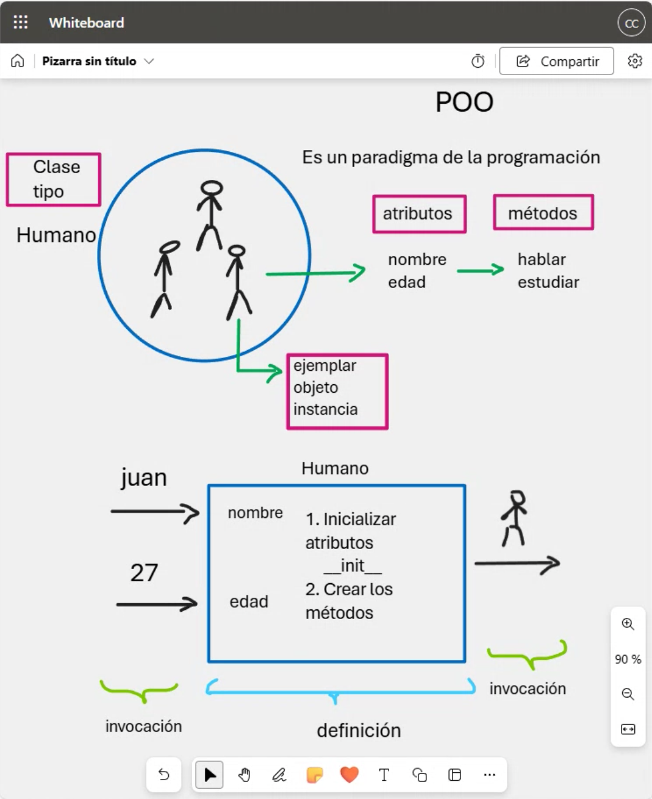
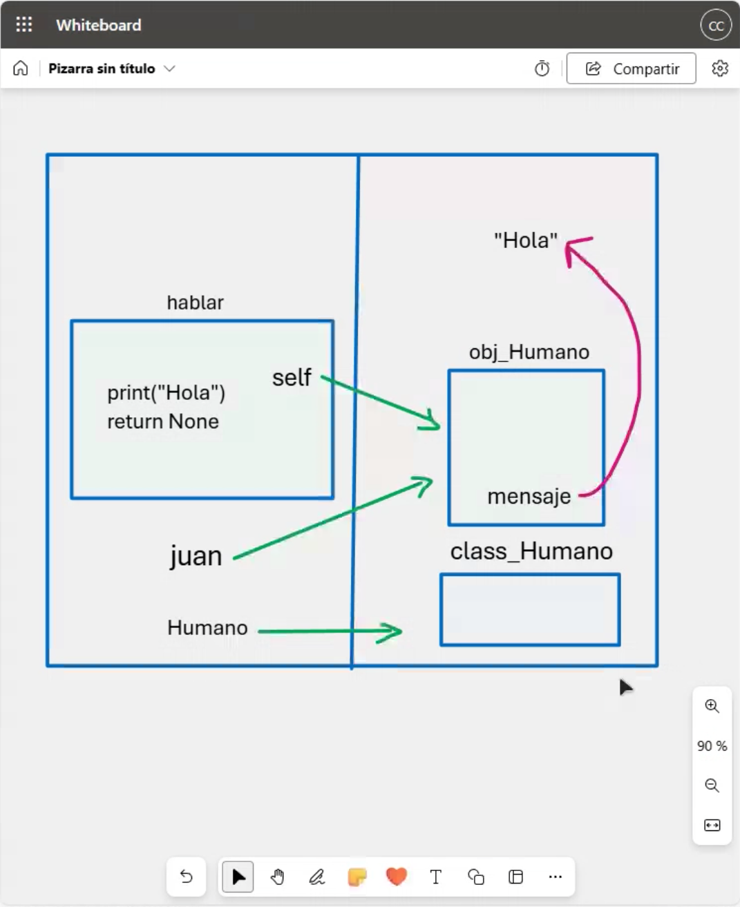
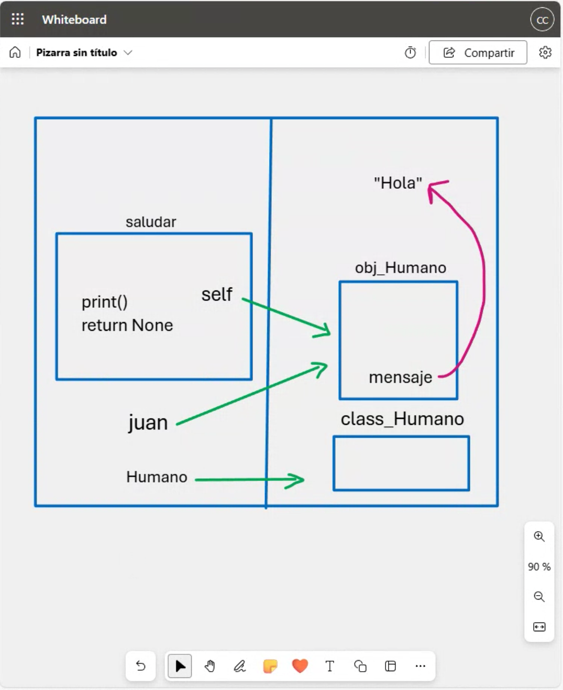
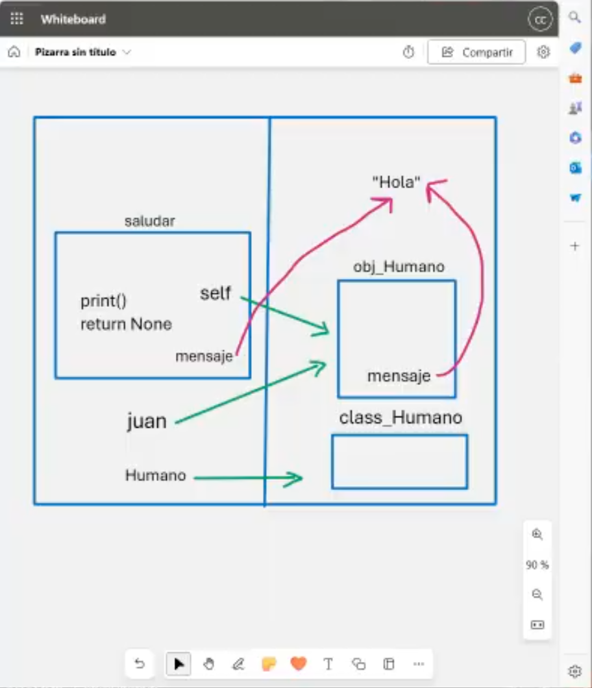

# Clase 13: Programación Orientada a Objetos (POO)

## Introducción
La **Programación Orientada a Objetos (POO)** es un paradigma de programación basado en la organización del código en **clases** y **objetos**, lo que permite mejorar la reutilización y estructuración del código.

## Conceptos Claves

1. **Clase**: Es una plantilla o molde para crear objetos.
2. **Objeto**: Es una instancia de una clase.
3. **Atributos**: Son las características o propiedades de un objeto.
4. **Métodos**: Son las acciones o comportamientos que puede realizar un objeto.
5. **Encapsulamiento**: Restringe el acceso directo a algunos de los detalles de un objeto.
6. **Herencia**: Permite que una clase adquiera atributos y métodos de otra clase.
7. **Polimorfismo**: Permite que diferentes clases puedan ser tratadas como una única interfaz común.

## Representación Visual

### 1. Concepto de Clase y Objeto


En la imagen se muestra cómo la clase **Humano** define los atributos `nombre` y `edad`, y los métodos `hablar` y `estudiar`. Luego, se crea una instancia de la clase llamada `juan`, asignándole valores específicos a los atributos.

### 2. Métodos en la Programación Orientada a Objetos


Se ilustra cómo un método (`hablar`) es parte de la clase **Humano** y cómo una instancia (`juan`) lo puede invocar.

### 3. Método `saludar`


En esta representación se muestra otro método, `saludar`, que forma parte de la clase y se invoca desde un objeto.

### 4. Flujo de Mensajes entre Objetos


Se visualiza cómo un mensaje se transmite desde un objeto a otro a través de métodos, generando una respuesta como "Hola".

## Implementación en Código

Ejemplo de implementación en **Python**:

```python
class Humano:
    def __init__(self, nombre, edad):
        self.nombre = nombre
        self.edad = edad
    
    def hablar(self):
        print(f"Hola, soy {self.nombre} y tengo {self.edad} años.")

# Creación de un objeto
juan = Humano("Juan", 27)
juan.hablar()
```

Este código define una clase **Humano**, inicializa sus atributos en el constructor `__init__`, y define el método `hablar`. Luego, se crea un objeto `juan` y se invoca el método `hablar`.

## Conclusión
La **POO** permite estructurar el código de manera modular y reutilizable. Su uso es esencial en la mayoría de los lenguajes de programación modernos como Python, Java y C++.

---

## 👨‍💻 Sobre el Autor

- **👤 Nombre:** Edwin Yoner
- **📧 Contacto:** [✉ edwinyoner@gmail.com](mailto:edwinyoner@gmail.com)
- **🔗 LinkedIn:** [🌐 linkedin.com/in/edwinyoner](https://www.linkedin.com/in/edwinyoner)

