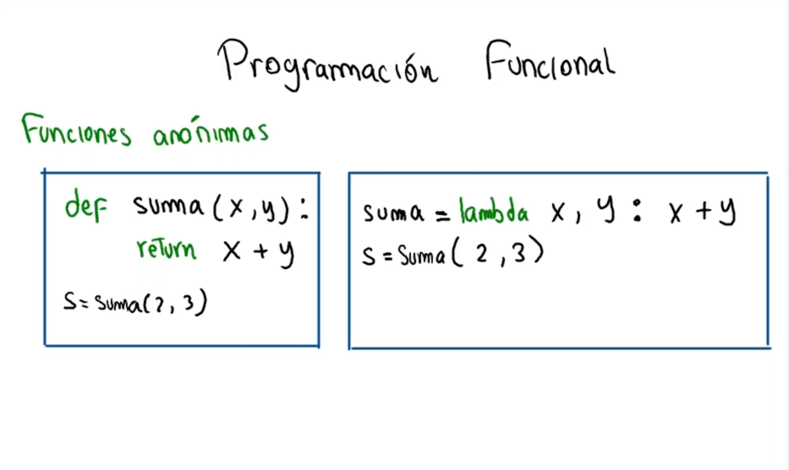
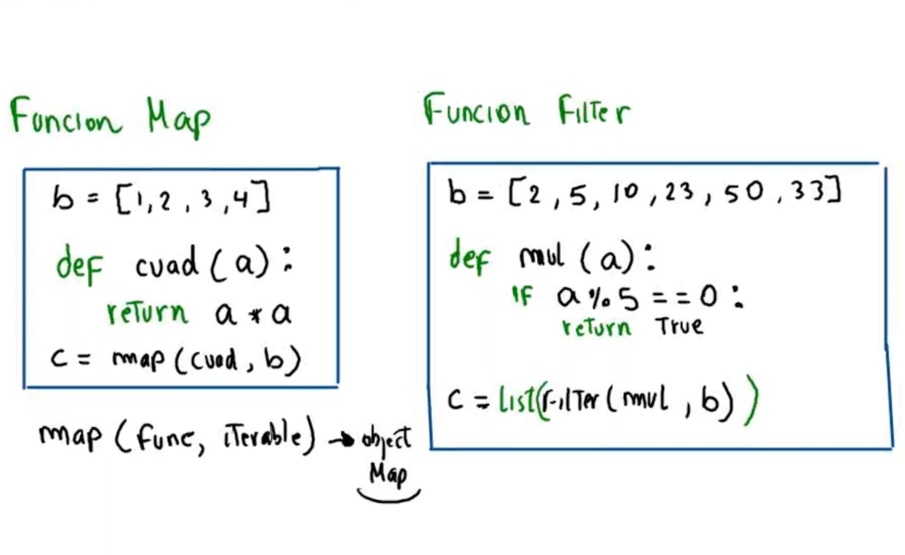

# Clase 15: Programación Funcional

## Introducción
La **programación funcional** es un paradigma de programación que trata la computación como la evaluación de funciones matemáticas y evita cambiar estados y datos mutables. Se basa en el uso de funciones como elementos fundamentales, favoreciendo la composición y reutilización del código. 

Python admite programación funcional a través de funciones anónimas (`lambda`), `map()`, `filter()`, `reduce()` y otras características clave.

## Características de la Programación Funcional

1. **Funciones de Primera Clase**: Las funciones pueden ser asignadas a variables, pasadas como argumentos y retornadas por otras funciones.
2. **Funciones Puras**: No dependen de variables externas y siempre producen el mismo resultado para una misma entrada.
3. **Inmutabilidad**: Se favorece el uso de estructuras de datos inmutables para evitar efectos colaterales.
4. **Recursividad**: Se usa en lugar de los bucles tradicionales.
5. **Evaluación Perezosa (Lazy Evaluation)**: Se evalúan las expresiones solo cuando es necesario.

## Representación Visual

### Funciones Anónimas


### `map()` y `filter()`


## Implementación en Código

### Funciones Anónimas (`lambda`)

```python
# Función normal
def suma(x, y):
    return x + y

s = suma(2, 3)
print(s)  # Salida: 5

# Función lambda
suma_lambda = lambda x, y: x + y
s = suma_lambda(2, 3)
print(s)  # Salida: 5
```

### Uso de `map()`

```python
b = [1, 2, 3, 4]

def cuadrado(a):
    return a * a

c = map(cuadrado, b)
print(list(c))  # Salida: [1, 4, 9, 16]
```

### Uso de `filter()`

```python
b = [2, 5, 10, 23, 50, 33]

def es_multiplo_de_5(a):
    return a % 5 == 0

c = filter(es_multiplo_de_5, b)
print(list(c))  # Salida: [5, 10, 50]
```

### Uso de `reduce()`

La función `reduce()` permite aplicar una función acumulativa a los elementos de un iterable.

```python
from functools import reduce

numeros = [1, 2, 3, 4, 5]

suma_total = reduce(lambda x, y: x + y, numeros)
print(suma_total)  # Salida: 15
```

## Beneficios de la Programación Funcional
✔ **Código más conciso**: Reduce la necesidad de estructuras repetitivas.

✔ **Facilidad de depuración**: Menos efectos colaterales al trabajar con datos inmutables.

✔ **Mayor expresividad**: Uso de funciones como valores permite componer operaciones de forma natural.

✔ **Optimización del rendimiento**: Funciones como `map()`, `filter()` y `reduce()` permiten manejar colecciones de datos de manera eficiente.

✔ **Mayor modularidad**: Facilita la reutilización de código mediante funciones pequeñas y reutilizables.

## Conclusión
La programación funcional en Python permite escribir código más conciso, expresivo y fácil de depurar. Su uso es fundamental en aplicaciones modernas donde la optimización del rendimiento y la escalabilidad del código son cruciales. El uso de funciones anónimas (`lambda`), `map()`, `filter()` y `reduce()` facilita el procesamiento de datos de manera eficiente y estructurada.

---

## 👨‍💻 Sobre el Autor

- **👤 Nombre:** Edwin Yoner
- **📧 Contacto:** [✉ edwinyoner@gmail.com](mailto:edwinyoner@gmail.com)
- **🔗 LinkedIn:** [🌐 linkedin.com/in/edwinyoner](https://www.linkedin.com/in/edwinyoner)