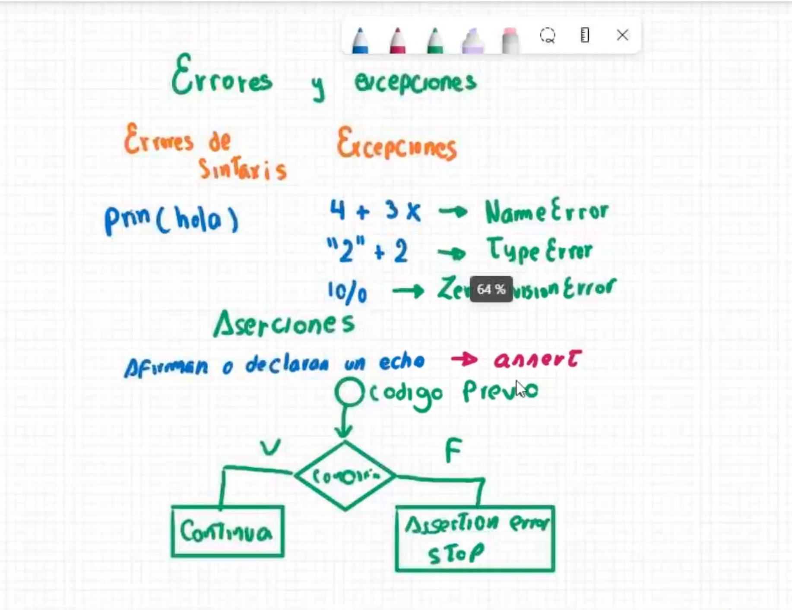

# Clase 16: Errores y Excepciones

## Introducción
En programación, es común encontrarse con errores y excepciones. Python proporciona mecanismos para manejar estos errores y evitar que el programa se detenga de manera inesperada. En esta clase aprenderemos sobre los distintos tipos de errores, excepciones y aserciones.

## Errores de Sintaxis
Los **errores de sintaxis** ocurren cuando el código no sigue las reglas del lenguaje de programación, lo que impide su ejecución. Un ejemplo de error de sintaxis en Python es:

```python
# Error de sintaxis por falta de comillas
prn(hola)  # Incorrecto
```

## Excepciones
Las **excepciones** ocurren durante la ejecución del programa y pueden ser manejadas con bloques `try-except`. Algunos ejemplos comunes son:

```python
# NameError: Variable no definida
print(4 + 3x)  # Incorrecto

# TypeError: No se puede sumar un string con un entero
print("2" + 2)  # Incorrecto

# ZeroDivisionError: División entre cero
print(10 / 0)  # Incorrecto
```

Cada una de estas excepciones puede ser capturada y manejada para evitar la interrupción del programa.

## Aserciones
Las **aserciones** (`assert`) permiten comprobar si una condición es verdadera. Si la condición es falsa, se lanza una excepción `AssertionError`, lo que detiene la ejecución del programa.

```python
x = -1
assert x >= 0, "El valor de x debe ser positivo"
```

### Diagrama de Flujo de Aserciones


## Manejo de Excepciones en Python
Podemos usar `try-except` para manejar errores de ejecución y evitar que el programa se detenga abruptamente:

```python
try:
    resultado = 10 / 0
except ZeroDivisionError:
    print("No se puede dividir entre cero")
```

También podemos usar `finally` para ejecutar código sin importar si hubo una excepción:

```python
try:
    archivo = open("datos.txt", "r")
    contenido = archivo.read()
except FileNotFoundError:
    print("El archivo no existe")
finally:
    print("Ejecución terminada")
```

## Conclusión
El manejo adecuado de errores y excepciones es fundamental para escribir código robusto y confiable. Python proporciona diversas herramientas para identificar y corregir errores antes de que afecten la ejecución del programa.

---

## 👨‍💻 Sobre el Autor

- **👤 Nombre:** Edwin Yoner
- **📧 Contacto:** [✉ edwinyoner@gmail.com](mailto:edwinyoner@gmail.com)
- **🔗 LinkedIn:** [🌐 linkedin.com/in/edwinyoner](https://www.linkedin.com/in/edwinyoner)