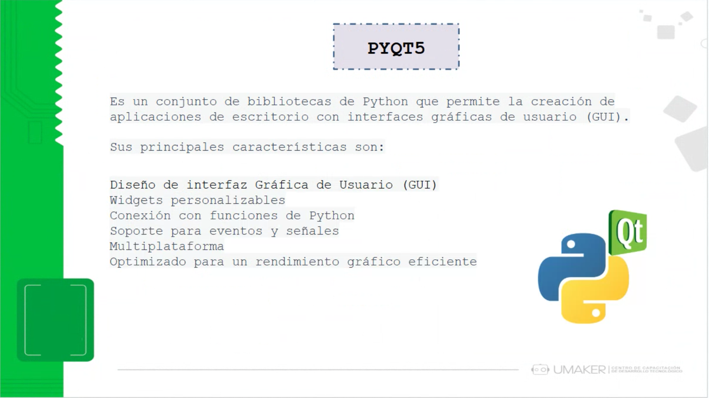
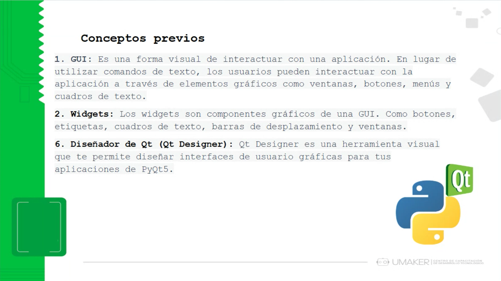
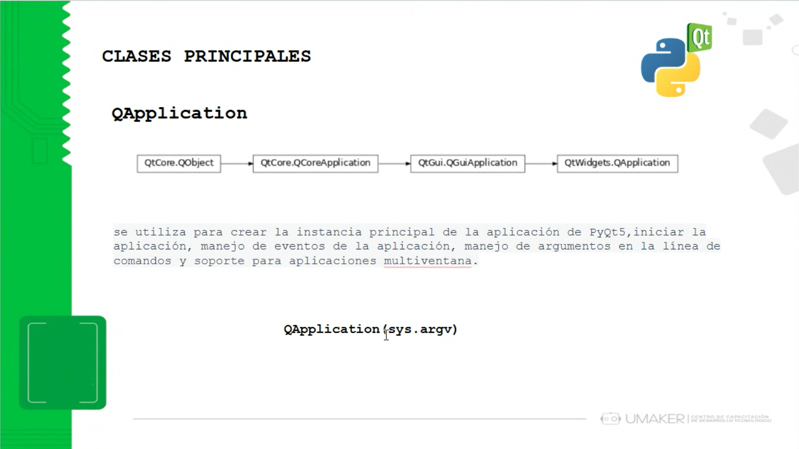
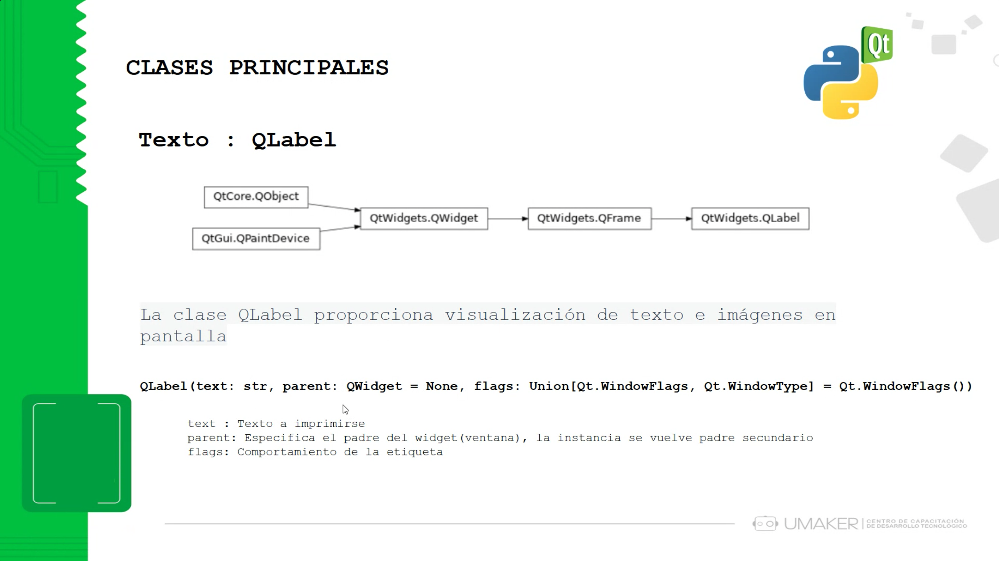
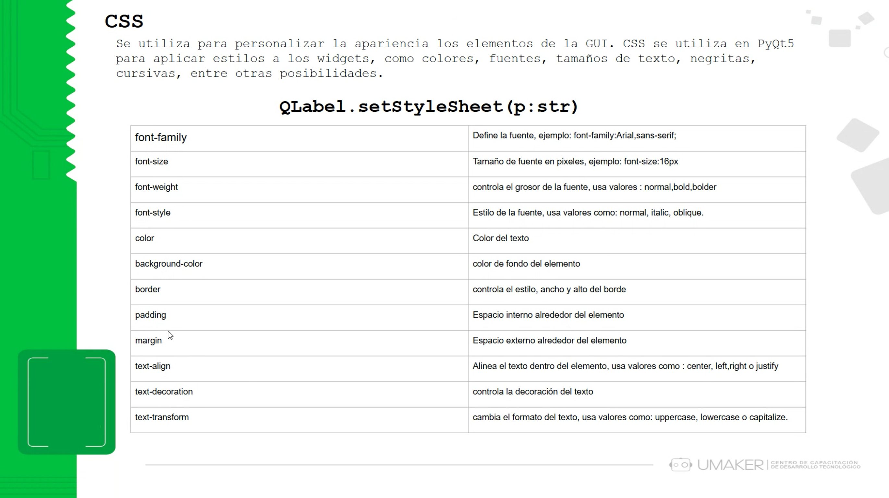
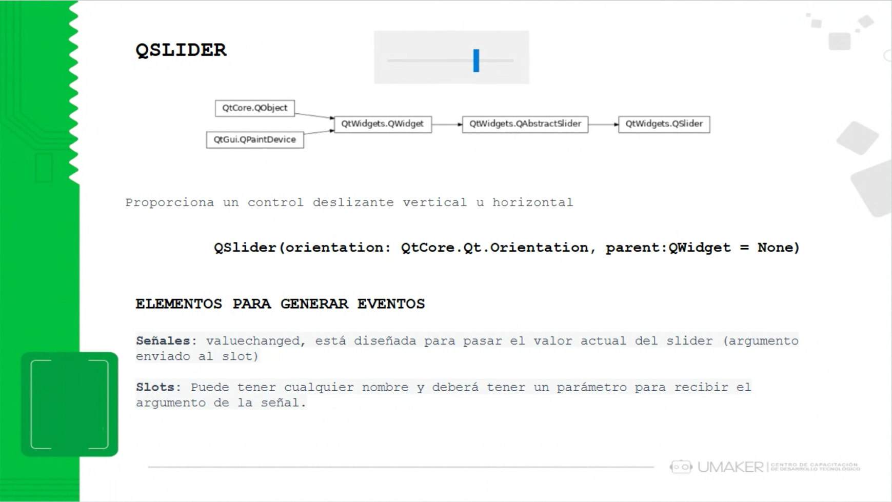
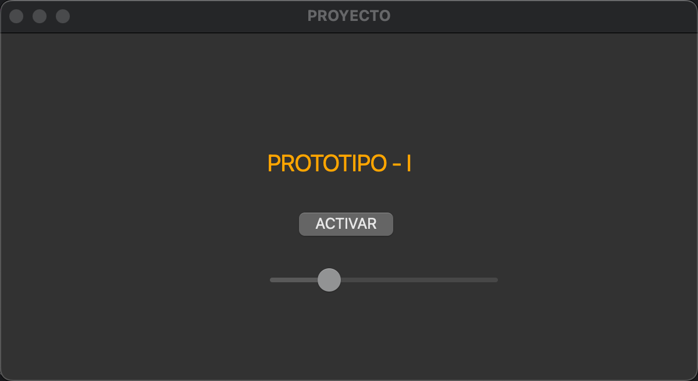

# Clase 17: Interfaces Gráficas

## Introducción

Las **Interfaces Gráficas de Usuario (GUI)** permiten a los usuarios interactuar visualmente con una aplicación. **PyQt5** es un conjunto de bibliotecas de Python que facilita la creación de aplicaciones de escritorio con una interfaz visual amigable.

## Características principales de PyQt5

- Diseño de **interfaz gráfica de usuario (GUI)**.
- Widgets personalizables.
- Conexión con funciones de Python.
- Soporte para eventos y señales.
- Multiplataforma.
- Optimizado para un **rendimiento gráfico eficiente**.

### PyQt5 - Introducción



PyQt5 es un conjunto de herramientas que permite la creación de interfaces gráficas para aplicaciones de escritorio en Python.

## Conceptos previos

### 1. GUI



Las **GUI** permiten a los usuarios interactuar con una aplicación mediante elementos gráficos como botones, cuadros de texto y menús.

### 2. Widgets

Los **widgets** son los elementos gráficos dentro de una interfaz, como botones, etiquetas y cuadros de texto.

### 3. Qt Designer

Qt Designer es una herramienta visual que permite diseñar interfaces gráficas sin escribir código.

## Clases principales en PyQt5

### `QApplication`



La clase `QApplication` es la base para cualquier aplicación en PyQt5. Se encarga de gestionar eventos, iniciar la aplicación y manejar múltiples ventanas.

Código de ejemplo:

```python
import sys
from PyQt5.QtWidgets import QApplication

app = QApplication(sys.argv)
```

### `QLabel` - Etiquetas de texto



`QLabel` se usa para mostrar texto o imágenes dentro de una interfaz gráfica.

Código de ejemplo:

```python
from PyQt5.QtWidgets import QLabel
label = QLabel("Hola, PyQt5")
```

### Uso de CSS en PyQt5



PyQt5 permite personalizar la apariencia de los widgets mediante **CSS**.

Ejemplo de uso:

```python
label.setStyleSheet("font-size: 16px; color: blue;")
```

## Botones en PyQt5

### `QPushButton`


Los botones permiten ejecutar acciones cuando el usuario los presiona.

Código de ejemplo:

```python
from PyQt5.QtWidgets import QPushButton
button = QPushButton("Activar")
```

## Sliders en PyQt5

### `QSlider`



El **QSlider** permite seleccionar valores de forma deslizante.

Código de ejemplo:

```python
from PyQt5.QtWidgets import QSlider
slider = QSlider()
```

## Proyecto



Ejemplo de una aplicación desarrollada con PyQt5 que incluye etiquetas, botones y sliders.

## Conclusión

PyQt5 es una poderosa herramienta para el desarrollo de interfaces gráficas en Python, permitiendo una experiencia interactiva y profesional.

---

## 👨‍💻 Sobre el Autor

- **👤 Nombre:** Edwin Yoner
- **📧 Contacto:** [✉ edwinyoner@gmail.com](mailto:edwinyoner@gmail.com)
- **🔗 LinkedIn:** [🌐 linkedin.com/in/edwinyoner](https://www.linkedin.com/in/edwinyoner)