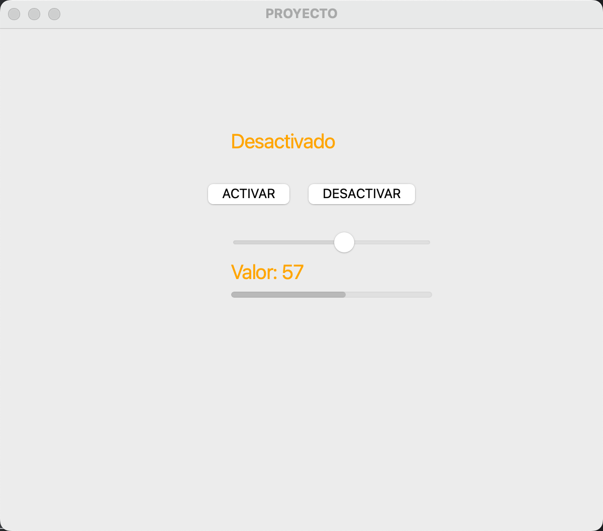
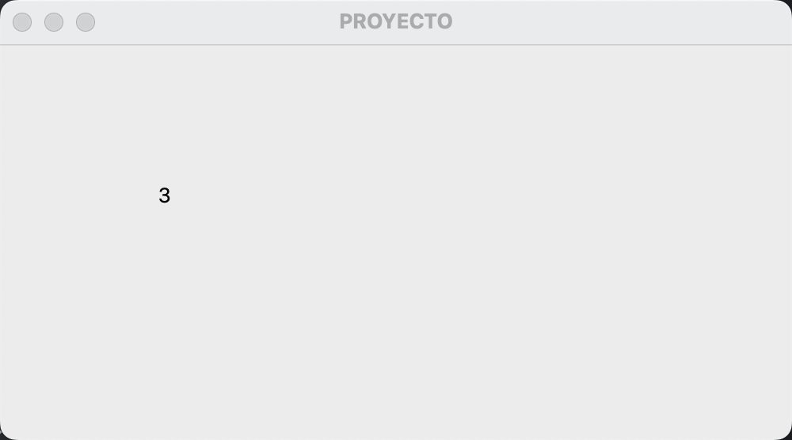

# Clase 18: Interfaces Gráficas

Este repositorio contiene ejemplos prácticos de **interfaces gráficas con PyQt5** en Python. Se incluyen ejemplos de **botones, sliders, etiquetas, barras de progreso y temporizadores** con interacciones dinámicas.

---

## 📷 Capturas de Pantalla

A continuación, se muestran las capturas de pantalla tomadas tras ejecutar los ejemplos:

### 🖥️ **Ejemplo 1: Interfaz con Slider, Botones y Barra de Progreso**

### 🖥️ **Ejemplo 2: Temporizador con `QTimer`**

---

## 📌 Contenido

1. **Interfaz con botones "Activar" y "Desactivar"**  
   - Cambia el texto de una etiqueta al presionar los botones.
   - Usa `QPushButton` para manejar eventos.

2. **Uso de un Slider (`QSlider`)**  
   - Permite cambiar el valor de una etiqueta en tiempo real.
   - Actualiza dinámicamente una barra de progreso (`QProgressBar`).

3. **Temporizador con `QTimer`**  
   - Incrementa automáticamente un contador y actualiza un `QLabel` cada segundo.
   - Se muestra el valor del contador en pantalla.

---

## 🔧 Requisitos

- Python 3.6 o superior.
- PyQt5 instalado (`pip install PyQt5`).

---

## 👨‍💻 Sobre el Autor

- **👤 Nombre:** Edwin Yoner
- **📧 Contacto:** [✉ edwinyoner@gmail.com](mailto:edwinyoner@gmail.com)
- **🔗 LinkedIn:** [🌐 linkedin.com/in/edwinyoner](https://www.linkedin.com/in/edwinyoner)