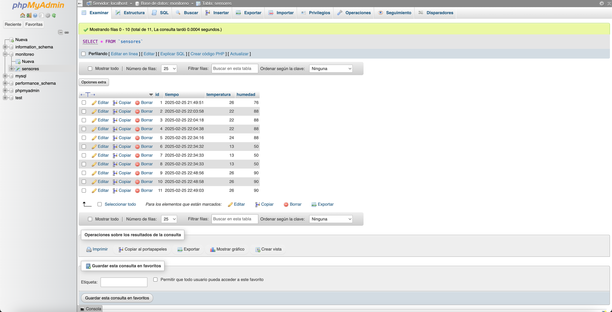
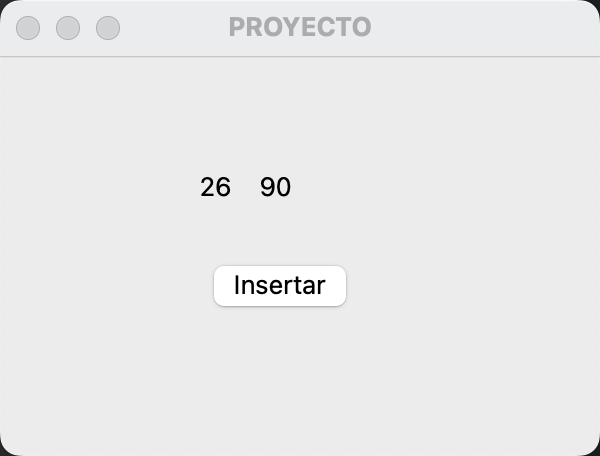

# Clase 20: Base de Datos

## Introducción
Las bases de datos permiten almacenar, organizar y gestionar grandes volúmenes de información de manera eficiente. En esta clase exploraremos conceptos clave, tipos de bases de datos y una implementación práctica con MySQL y phpMyAdmin.

## Conceptos Claves
- **Base de Datos:** Conjunto de datos organizados y estructurados para su acceso rápido y eficiente.
- **DBMS (Sistema de Gestión de Base de Datos):** Software que permite administrar bases de datos (ejemplo: MySQL, PostgreSQL, Oracle, SQL Server).
- **SQL (Structured Query Language):** Lenguaje utilizado para manipular y consultar bases de datos relacionales.

## Tipos de Bases de Datos
1. **Relacionales:** Utilizan tablas con filas y columnas. Ejemplo: MySQL, PostgreSQL, SQL Server.
2. **NoSQL:** Usan estructuras como documentos, grafos o clave-valor. Ejemplo: MongoDB, Redis, Cassandra.

## Creación de una Base de Datos en MySQL
Para crear una base de datos llamada `monitoreo`, se puede ejecutar la siguiente consulta en MySQL:



```sql
CREATE DATABASE monitoreo;
USE monitoreo;
```

## Creación de una Tabla
A continuación, se crea una tabla `sensores` con los campos `id`, `tiempo`, `temperatura` y `humedad`:

```sql
CREATE TABLE sensores (
    id INT AUTO_INCREMENT PRIMARY KEY,
    tiempo DATETIME DEFAULT CURRENT_TIMESTAMP,
    temperatura INT,
    humedad INT
);
```

## Inserción de Datos
Para insertar un nuevo registro en la tabla `sensores`:

```sql
INSERT INTO sensores (temperatura, humedad) VALUES (26, 90);
```

## Visualización de Datos en phpMyAdmin
En phpMyAdmin, podemos ver los datos insertados ejecutando:

```sql
SELECT * FROM sensores;
```



## Conclusión
Las bases de datos son esenciales para el almacenamiento y gestión de información. MySQL y phpMyAdmin facilitan su creación y administración, permitiendo realizar consultas y modificaciones de manera eficiente.

---

## 👨‍💻 Sobre el Autor

- **👤 Nombre:** Edwin Yoner
- **💎 Contacto:** [✉ edwinyoner@gmail.com](mailto:edwinyoner@gmail.com)
- **🌐 LinkedIn:** [🌐 linkedin.com/in/edwinyoner](https://www.linkedin.com/in/edwinyoner)

